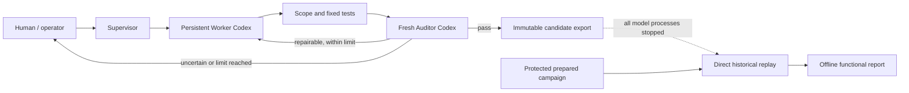

# Research Automation Supervisor

Research Automation Supervisor is a local Python orchestrator for bounded,
auditable research-software changes. A human freezes the contract, paths, prompts,
models, tests, and repair limit; the package then runs a persistent Worker Codex,
fresh independent Auditor Codex instances, deterministic evidence collection, and an
immutable candidate export. Protected historical evaluation stays offline and outside
every model process.

## What it solves

Long-running model-assisted research work is difficult to reproduce when prompts,
test choices, session identity, and repair decisions are implicit. This project makes
those boundaries explicit and durable: exact inputs are hashed, state transitions are
journaled, tests use fixed argument vectors, changed paths are checked against frozen
scope, repairs are bounded, and uncertain recovery pauses for a human.

## Architecture

- The human/operator owns the contract, permissions, acceptance tests, and pause
  decisions.
- The Supervisor plans visible campaign handoffs but cannot change frozen authority.
- One persistent Worker Codex implements a task and receives bounded repair or human
  continuation prompts through its exact session ID.
- Each Auditor Codex is fresh, ephemeral, read-only, and independent of the Worker.
- The deterministic engine decides transitions from structured results, Git evidence,
  fixed tests, and the configured repair limit.
- A completed visible campaign publishes a sealed `final-candidate/` changed-files
  export.
- Historical functional replay is a separate non-model host command run only after
  every model process has stopped.



See [architecture](docs/architecture.md), [single-substage behavior](docs/workflow_engine.md),
and [campaigns](docs/campaigns.md).

Future work is documented separately in the [0.3–0.6 upgrade roadmap](docs/roadmap/README.md).
It is planning only: Physics Auditor v1 is the first proposed milestone, followed by
provider-neutral adapters, explicit parallel DAG campaigns, and later physics research
profiles. Those features are not available in version 0.2.0.

## Current status

Version `0.2.0` is the first package-ready release. The deterministic workflow and
visible-only campaign/candidate split are qualified. The completed
`gl-five-visible-campaign-v1` candidate passed the original historical functional
replay for all five tasks: hidden acceptance 5/5, visible acceptance 5/5, and
changed-path scope 5/5. Exact historical identity was 0/5.

Functional correctness and exact reproduction answer different questions. The five
candidates satisfied the historical behavior and scope checks without reproducing the
historical patch byte-for-byte. The authoritative evidence is the direct original
historical replay; the packaged Bubblewrap evaluator is experimental and its earlier
0/5 and 4/5 outputs are superseded. See the tracked
[validation record](docs/validation/five_task_historical_replay.md).

The supported path is synchronous and Linux-qualified. It is not a general scheduler,
does not prove model correctness, and does not make the experimental hermetic
evaluator portable across arbitrary toolchains.

## Requirements

- Linux is the qualified operating system. macOS imports and basic local workflows
  may work but are not release-qualified. Native Windows is unsupported; WSL2 is not
  yet qualified by this project.
- Python 3.11 or newer.
- Git and a clean Git worktree for workflow execution.
- Codex CLI 0.144.0 or newer for real Worker, Auditor, or Supervisor actions.
- Project-specific compilers, libraries, or test tools required by your frozen
  acceptance commands.
- Docker is not required. Bubblewrap and compiler-closure dependencies are needed
  only for the experimental packaged evaluator.

The bundled synthetic quick start uses a local test double and never contacts a model
service.

## Installation

Development installation:

```bash
python3 -m venv ".venv"
".venv/bin/python" -m pip install --upgrade pip
".venv/bin/python" -m pip install -e ".[dev]"
".venv/bin/research-supervisor" --version
```

Wheel installation after a local build:

```bash
python3 -m pip install "dist/research_automation_supervisor-0.2.0-py3-none-any.whl"
research-supervisor --version
research-supervisor doctor
```

`doctor` is read-only. It checks Python, Git, repository state, Codex presence/version,
and normalized login status without printing raw authentication output.

## Ten-minute synthetic quick start

This runs the complete single-substage engine with bundled synthetic Worker and
Auditor responses. The `codex` executable placed first on `PATH` is an obvious local
test double; no OpenAI or other model process is started.

```bash
quickstart_root="$PWD/ras-synthetic-quickstart"
research-supervisor init-example --output "$quickstart_root"
git -C "$quickstart_root/project" init --initial-branch=main
git -C "$quickstart_root/project" config user.name "Synthetic Quick Start"
git -C "$quickstart_root/project" config user.email "synthetic@example.invalid"
git -C "$quickstart_root/project" add .
git -C "$quickstart_root/project" commit -m "synthetic baseline"
research-supervisor validate-substage "$quickstart_root/config/substage.yaml"
PATH="$quickstart_root/project/tools:$PATH" research-supervisor run-substage "$quickstart_root/config/substage.yaml" --runs-dir "$quickstart_root/runs"
research-supervisor substage-status "$(find "$quickstart_root/runs" -mindepth 1 -maxdepth 1 -type d -name 'synthetic-quickstart-*' -print -quit)"
```

The result should be `completed`; `project/src/ready.txt` is the only workspace
change. For a real workflow, install and authenticate the official Codex CLI, create a
separate clean worktree, and do not prepend the synthetic `tools` directory to
`PATH`. More detail is in [getting started](docs/getting-started.md).

## Define a project and substage

A schema-version-1 substage YAML resolves paths relative to itself and freezes the
workspace, contract, role prompts, model settings, exact acceptance-test argument
vectors, allowed/protected paths, and repair limit:

```yaml
schema_version: 1
substage_id: parser-cleanup
title: Bounded parser cleanup
workspace: ../project
contract_path: ../project/control/contract.md
worker_initial_prompt_path: ../project/control/worker-initial.md
worker_repair_prompt_path: ../project/control/worker-repair.md
auditor_prompt_path: ../project/control/auditor.md
worker_model: gpt-5.6-sol
worker_reasoning_effort: high
worker_timeout_seconds: 1800
auditor_model: gpt-5.6-sol
auditor_reasoning_effort: high
auditor_timeout_seconds: 1800
acceptance_tests:
  - id: unit-tests
    argv: [python, -m, pytest, -q]
    cwd: ../project
    timeout_seconds: 1800
    max_stdout_bytes: 10485760
    max_stderr_bytes: 10485760
allowed_paths: [src/**, tests/**]
protected_paths: [control/**]
max_repair_rounds: 2
checkpoint_after: false
```

Contract and prompt files inside the workspace must be protected. Unknown fields,
duplicate IDs, unsafe traversal, dirty baselines, and allowed/protected conflicts fail
before Codex starts.

## Worker and Auditor roles

The Worker runs with workspace-write sandboxing, disabled model web/workspace network,
approval `never`, ignored user rules/configuration, and a strict output schema. One
explicit worker session ID is persisted; a repair never substitutes another worker.

An Auditor is a fresh `--ephemeral`, read-only Codex session. It receives the frozen
contract and deterministic evidence only after scope and fixed tests pass. Auditor
findings are advisory until the engine validates their schema and applies fixed state
rules.

## Run one deterministic substage

```bash
research-supervisor validate-substage "control/substage.yaml"
research-supervisor run-substage "control/substage.yaml" --runs-dir "runs/workflows"
```

The command is synchronous. Exit 0 means completed; 2 invalid input; 3 missing
dependency; 4 unrecoverable state/integrity failure; 5 human pause; 6 repair-limit
pause; 7 checkpoint pause; and 8 aborted.

## Run a multi-task campaign

Visible campaigns sequence multiple Stage 2 tasks through a planning Supervisor and
finish by exporting one immutable candidate:

```bash
research-supervisor run-visible-campaign "campaign/visible-campaign.yaml" --runs-dir "runs/campaigns"
research-supervisor visible-campaign-status "runs/campaigns/CAMPAIGN-RUN"
```

Campaign manifests contain visible authority only. Gold, hidden tests, historical
evaluators, and offline package locators are rejected before model launch. See
[campaigns](docs/campaigns.md) for the schema and lifecycle.

## Read evidence and candidate exports

Each run has canonical `state.json` and `result.json`, an append-only hash-chained
`journal.jsonl`, action intents/completions, bounded redacted process logs, Git/scope
evidence, fixed-test results, structured Worker/Auditor handoffs, and escalation
records. Status commands verify durable evidence before displaying it; they do not
repair contradictions.

A completed visible campaign publishes `final-candidate/candidate-manifest.json`,
`candidate.json`, and per-task changed-file overlays/evidence. Payload files are
read-only and manifest-pinned. Copy the complete candidate directory; do not edit it.

## Resume, repair, and human pauses

`resume-substage RUN` continues only a nonterminal interrupted run whose frozen inputs,
repository identity, journal, and action proof still agree. A known complete action is
finalized exactly once; uncertain external action completion pauses instead of being
repeated.

Automatic repairs use the same Worker session and stop at `max_repair_rounds`. From a
human or repair-limit pause, write a separate exact instruction file and run:

```bash
research-supervisor continue-substage "runs/workflows/RUN" --instruction "control/human-continuation.md"
```

Use `abort-substage` only when you intentionally want a durable terminal abort.

## Historical replay and evaluation

Stop every Supervisor, Worker, Auditor, Codex, and other model process before making
protected material available. Then use the original evaluator directly:

```bash
run-direct-historical-replay --candidate "private/final-candidate" --prepared-campaign "private/prepared-campaign" --output "private/direct-replay-report"
```

The command launches no model adapter. For each task it exports the committed baseline
to a temporary workspace, initializes ephemeral Git metadata, applies only the sealed
candidate changes, makes only that disposable tree user-writable for hidden overlay,
runs the prepared campaign's functional evaluator, and removes the workspace by
default. Add `--keep-workspaces` only for private diagnostics.

`passed` means hidden acceptance, visible acceptance, and changed-path checks all
passed. `functional_failure`, `evaluator_infrastructure_failure`, and
`no_structured_result` are separate outcomes. Exact identity is a separate comparison;
functional success does not imply byte-for-byte historical reproduction.

Never pass a prepared campaign, gold tree, protected fixture, hidden test, or raw
evaluation output to any model. See [evaluation](docs/evaluation.md).

## Security and permissions

The safe public pattern is a clean isolated Git worktree, frozen protected control
files, narrow allowed paths, fixed offline tests, bounded repairs, and human review of
pauses. The orchestrator deliberately invokes Codex noninteractively with role-specific
sandboxing and no approvals because its own configuration is frozen and constrained.
This is different from recommending approval-free broad access to a general user.

Official Codex guidance describes workspace-write plus on-request approvals as the
normal interactive boundary, with network disabled by default. The `--yolo` alias
disables approvals and sandboxing; use it only as an advanced unattended option inside
an externally hardened, disposable, trusted environment. This project never adds
`--yolo` to Worker or Auditor commands.

Do not expose hidden evaluation data to models, expand workspace roots to include
private evaluation trees, store credentials in manifests, or run real evaluation while
model processes exist. See [security](docs/security.md) and the official
[Codex approval guidance](https://learn.chatgpt.com/docs/agent-approvals-security.md).

## Troubleshooting

- Approval prompts: this package uses fixed noninteractive role policy; an unexpected
  prompt usually indicates a Codex version/configuration mismatch. Run `doctor`.
- Missing Codex: install/authenticate Codex CLI 0.144.0 or newer, or use only the
  bundled non-model synthetic quick start.
- Dirty worktree: commit/stash unrelated work or create a dedicated worktree. The
  engine intentionally rejects tracked or untracked baseline changes.
- Acceptance-test ID mismatch: Supervisor/Auditor required-check IDs must exactly match
  the frozen YAML IDs.
- Interrupted run: use the appropriate status command first, then `resume-*` only for
  a nonterminal state. Never delete or hand-edit journal evidence.
- Dependency/environment failure: distinguish missing tools or evaluator qualification
  from candidate functional failure.
- Exported mode `0400`: do not chmod the candidate. Direct replay adds owner write only
  inside its disposable copy so hidden overlay can replace files.

More cases are in [troubleshooting](docs/troubleshooting.md).

## Development

```bash
".venv/bin/pytest" -q
".venv/bin/ruff" check .
".venv/bin/mypy" src/research_automation_supervisor
".venv/bin/python" -m build
```

Do not run real protected historical evaluation during ordinary development. Direct
replay tests and the quick start use synthetic fixtures only. See
[development](docs/development.md).

## Repository layout

```text
src/research_automation_supervisor/  installable package and console commands
tests/                               synthetic unit/integration tests
examples/                            source-checkout examples
docs/                                user, architecture, security, and release docs
STAGE_*_CONTRACT.md                  preserved architectural contracts
README_STAGE_*.md                    preserved stage history
runs/                                ignored local runtime evidence (`.gitkeep` only)
dist/                                ignored local wheel and source distribution
```

## Known limitations and experimental components

- Release qualification is Linux-only and workflows are synchronous.
- Acceptance commands can require project-specific toolchains not supplied by the
  wheel.
- Semantic contract satisfaction remains model/human judgment around deterministic
  evidence; exact historical identity is not expected.
- Retrospective and live shadow systems remain informational and cannot enable
  automation.
- `prepare-historical-replay-evaluation-package`, `evaluate-historical-replay`, and
  `report-historical-replay-evaluation-commands` are experimental research
  infrastructure. Their Bubblewrap/compiler closure is not the supported evaluation
  path, and an infrastructure qualification failure is not a candidate failure.

## License and contributions

The project is distributed under the [MIT license](LICENSE). Contributions should be
small, tested, scope-bounded, and must not include credentials, local run trees,
candidate exports, prepared campaigns, historical gold, or protected fixtures. Open a
reviewable change with Ruff, mypy, the complete test suite, and package build results;
do not publish artifacts or tags without maintainer approval.
