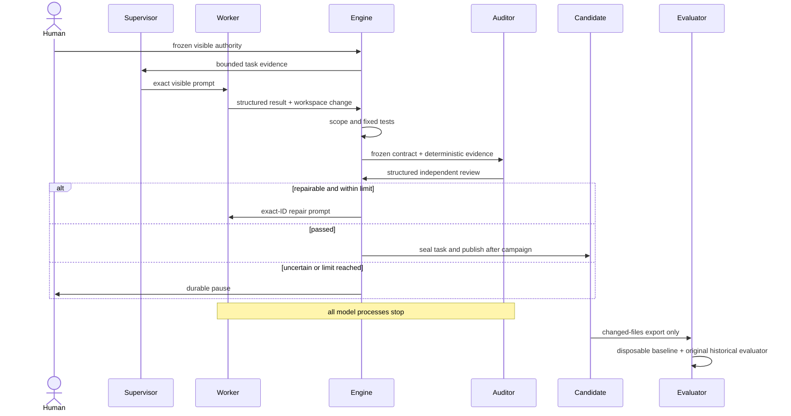

# Architecture

Research Automation Supervisor separates human authority, model actions,
deterministic transitions, candidate publication, and protected evaluation.

## Authority layers

1. The human freezes a contract, visible context, prompts, scope, exact acceptance
   commands, models, timeouts, and repair limit.
2. A Supervisor may select the next visible prompt/action in a multi-task campaign,
   but cannot change that frozen authority.
3. One persistent Worker Codex edits the task workspace. Each repair resumes only its
   exact structured session ID.
4. Deterministic Git/scope collection and fixed tests run before audit.
5. A fresh ephemeral Auditor Codex reads the workspace and evidence without write
   permission.
6. Engine-owned state rules complete, repair, or pause. Models never select durable
   transitions directly.
7. Terminal task bytes are sealed; campaign completion publishes a manifest-pinned
   immutable candidate.
8. Only after every model process stops may a separate host process read protected
   historical authority and evaluate disposable candidate overlays.

## Deterministic core

The package uses strict Pydantic models, duplicate-key-safe YAML loading, canonical
relative paths, shell-free argument vectors, bounded process output, explicit
timeouts, whole-process-group cleanup, credential-shaped environment filtering, and
canonical JSON. Git evidence records the clean baseline, status, patch identity,
changed objects, and scope result without allowing a model to define the check.

Every run has an append-only semantic hash-chained journal plus canonical state and
result snapshots. Action intent is durable before process launch. Recovery validates
the complete evidence set: it finalizes a provably completed action exactly once and
pauses when completion is uncertain. It never guesses, retries an uncertain external
action, or silently heals contradictory evidence.

The model-free PA-2 Physics Oracle substrate is deliberately separate from this state
machine and its journal. A trusted catalog selects one fixed, hash-pinned Python
intent. Bubblewrap supplies a read-only workspace, scratch-only writes and an actual
separate network namespace; unavailable isolation rejects the action before launch.
Git identity is compared before and after, and a separate PA-2 action-record chain and
canonical completion proof bind the result. See [trusted Physics Oracle
execution](physics_oracle_execution.md). Ordinary schema-version-1 substages never
enter this path.

## Model boundaries

The role adapter supplies fixed policy:

| Role | Session | Sandbox | Approval | Network |
| --- | --- | --- | --- | --- |
| Supervisor | persistent | read-only | never | disabled |
| Worker | persistent exact ID | workspace-write | never | disabled |
| Auditor | fresh ephemeral | read-only | never | disabled |

Prompts are assembled in memory from exact human bytes, frozen contracts, canonical
evidence, and engine-owned schemas. Rendered prompts are not stored by the workflow.
User configuration, rules, web search, workspace network, and skill dependency
installation are disabled for these actions.

The deterministic engine constrains process policy; it does not claim that a model is
semantically correct. Human review and fixed acceptance remain authoritative.

## Visible campaigns and candidates

Visible campaign inputs cannot contain gold, hidden tests, historical evaluators, or
offline package locators. The campaign sequences ordinary single-substage workflows
and records task reports. Each terminal task captures a sealed candidate input before
its terminal transition. Once every task is terminal, final publication copies those
sealed inputs into `final-candidate/` and writes a canonical manifest.

The candidate contains only changed-file overlays, operations/modes/hashes, source and
execution baseline provenance, visible tests, scope evidence, patches, and bounded
terminal summaries. It excludes session caches, credentials, protected evaluation
material, and mutable campaign control state.

## Evaluation boundary

`run-direct-historical-replay` is a separate console entry point and imports no
campaign engine or model adapter. It accepts explicit candidate and prepared-campaign
roots, verifies their mapping, exports each committed baseline, creates ephemeral Git
metadata, applies only the candidate changes, and runs the original declared
functional evaluator. Only the disposable workspace is made owner-writable. Input
fingerprints are compared after replay.

The actual security boundary is process separation: no model process may exist while
protected fixtures, gold, or evaluator authority are available. Portability and
hermetic toolchain closure are useful research goals but are not required to establish
the qualified five-task result.

The older Bubblewrap packaged evaluator remains tested experimental infrastructure.
It can report environment qualification separately from candidate functionality, but
it is not the supported or authoritative campaign evaluator.

## Historical layers

The preserved stage contracts document how the system grew:

- Stage 0: strict contracts and read-only diagnostics;
- Stage 1: exact-prompt deterministic Codex transport;
- Stage 2: durable single-substage Worker/Auditor workflow;
- Stage 3: retrospective blind informational calibration;
- Stage 4: live, observation-only supervisor shadowing;
- Stage 5A: visible multi-task campaign and immutable candidate export;
- release closure: direct original historical replay and installable package.

Stage 3/4 readiness remains informational (`automation_enabled: false`). The current
supported execution path is the Stage 2 workflow plus visible campaign composition;
historical evaluation remains outside it.
