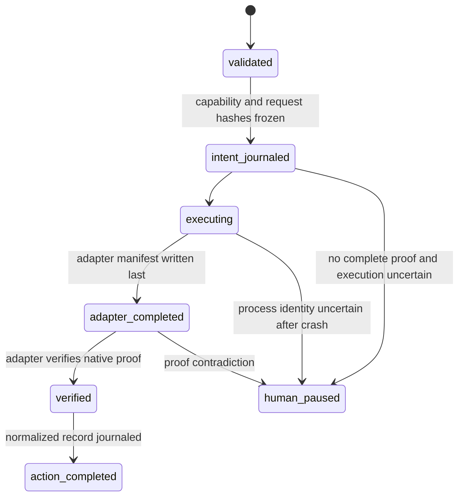

# Agent backend abstraction roadmap

Status: proposed design for `0.4.0`, not current capability. Version 0.2.0 is
Codex-backed; it does not support arbitrary providers or heterogeneous role backends.
Names marked **Proposed** do not exist in 0.2.0.

## Goals

- Extract a provider-neutral action contract without weakening the exact current Codex
  command, role policy, evidence, recovery, or session behavior.
- Permit explicit backend/model selection per Supervisor, Worker, Code Auditor, and
  Physics Auditor role after deterministic capability negotiation.
- Support both exact provider-persistent sessions and explicitly stateless,
  engine-reconstructed turns.
- Add a constrained generic executable adapter for providers that can meet the
  normalized protocol.
- Keep model outputs as untrusted typed inputs and provider-native records as
  adapter-owned evidence.

## Non-goals

- Claiming that arbitrary providers work in 0.2.0 or merely because a provider name can
  be configured.
- Automatic backend/model fallback, provider routing based on model prose, or silent
  capability downgrade.
- A plugin namespace, dynamic Python imports from manifests, shell commands, remote
  scheduler design, provider billing management, or live-provider release tests.
- Changing Physics Auditor report semantics, scientific gates, protected-data rules,
  or historical evaluation.
- Persisting raw API tokens, authorization headers, prompts, or provider transcripts.

## Current Codex adapter mapping

The abstraction must begin as a lossless mapping, not a rewrite of behavior.

| Current 0.2.0 component | Current responsibility | Proposed neutral counterpart |
|---|---|---|
| `CodexRunRequest` | Human request fields: run/role/workspace/prompt/model/effort/timeout | **Proposed** `AgentRunRequest` |
| `PreparedCodexRequest` | Resolved workspace/prompt bytes/hash and derived `RolePolicy` | **Proposed** `PreparedAgentRequest` |
| `CodexRunResult` | Normalized transport status/timing/artifact summary | **Proposed** `AgentRunResult` |
| `RolePolicy` / `ROLE_POLICIES` | Fixed sandbox, approval, ephemerality by role | **Proposed** `AgentPermissionPolicy`, still engine-owned |
| `execute_codex_request` | Load one Stage 1 YAML request and launch | Compatibility CLI path, unchanged in 0.4 |
| `run_prepared_codex` | Shell-free Codex launch, bounded IO, redaction, artifacts | `CodexAgentAdapter.execute` compatibility implementation |
| `build_codex_command` | Exact safe CLI argument vector | Adapter-private command builder |
| `CodexInvoker` | Injectable Stage 2 callable | **Proposed** `AgentAdapter` protocol |
| `WorkflowServices.codex_invoker` | Workflow injection point | `WorkflowServices.agent_registry` or injected resolver |
| `_prepared_codex_request` | Maps Worker/Auditor role config into Codex request | Provider-neutral request builder plus adapter translation |
| `PendingAction.codex_executable` and Codex fields | Durable action intent | Versioned **Proposed** `AgentPendingAction` |
| `CodexActionRecord` | Verified completion and structured result | **Proposed** `AgentActionRecord` with adapter-evidence digest |
| `NormalizedCodexRequest`, `CodexMetadata`, `Stage2CompletionManifest` | Exact Codex proof | Adapter-owned `codex` evidence verified by compatibility adapter |
| `verify_codex_artifacts` | Reconstructs trusted completion from Codex files/events | `CodexAgentAdapter.verify_completion`; normalized proof above it |
| `worker_thread_id` | Exact persistent Codex `thread.started` identity | **Proposed** `AgentSessionRef`, adapter-qualified |

Current Codex behavior to preserve includes: stdin-only prompt delivery; fixed
`--ask-for-approval never`; role-derived `workspace-write` or `read-only`; disabled
network/web; ignored user config/rules; no shell; bounded stdout/stderr; process-group
cleanup; strict event handling; secret-shaped environment removal; atomic artifacts;
completion manifest; exact persistent Worker/Supervisor resume; fresh ephemeral
Auditors; no automatic retries; and pause on uncertain completion.

## Proposed `AgentAdapter` protocol

The protocol is an internal Python boundary. Manifests select registered IDs, never
import code.

```python
class AgentAdapter(Protocol):
    @property
    def adapter_id(self) -> str: ...

    def capabilities(self, backend: BackendConfiguration) -> AdapterCapabilities: ...

    def prepare(
        self,
        request: AgentRunRequest,
        prompt: FrozenPrompt,
        output_schema: FrozenOutputSchema,
        policy: AgentPermissionPolicy,
    ) -> PreparedAgentRequest: ...

    def execute(
        self,
        prepared: PreparedAgentRequest,
        context: AgentExecutionContext,
    ) -> AgentRunResult: ...

    def verify_completion(
        self,
        intent: AgentPendingAction,
    ) -> VerifiedAgentCompletion: ...
```

`prepare` is read-only and performs provider validation before an intent is journaled.
`execute` exclusively creates its adapter artifact directory and must write an
adapter-owned completion marker last. `verify_completion` is the only route from
provider-native artifacts to normalized trusted completion during normal execution or
crash recovery. An adapter cannot directly change workflow state.

The registry is a fixed mapping assembled by package code, initially:

```text
codex_exec_v1  -> CodexAgentAdapter
generic_exec_v1 -> GenericExecAdapter
```

Unknown adapter IDs fail validation. Registration is not a general extension
namespace; adding an adapter remains a reviewed package change with conformance tests.

## Normalized request and result models

### Proposed request

**Proposed** `AgentRunRequest` is strict and immutable:

```json
{
  "schema_version": 1,
  "action_id": "physics-auditor-r000",
  "role": "physics_auditor",
  "backend_id": "codex-local",
  "model_id": "gpt-5.6-sol",
  "workspace": "/resolved/project",
  "prompt_sha256": "5df6d46d6c46f84f44bfa3f1d75b4ee29882f15532e980bda745e21b44f28c4b",
  "output_schema_sha256": "cc9af47be843ea7c5297a15c308a6290ac67bcca66791308a0c69ec945122248",
  "timeout_seconds": 1800,
  "session": {
    "mode": "fresh",
    "resume_ref": null,
    "history_manifest_sha256": null
  },
  "permission_policy": {
    "workspace": "read_only",
    "scratch": "action_owned_write",
    "network": "disabled",
    "approval": "never"
  },
  "required_capability_profile": "physics_auditor_v1"
}
```

Prompt and schema bytes live only in `PreparedAgentRequest`; normalized persisted
requests contain hashes, byte counts and safe locators. `role` is a closed enum:
`supervisor`, `worker`, `code_auditor`, and `physics_auditor`. Fixed tests/oracles are
not agent roles.

The normalized model deliberately omits provider-specific reasoning parameters. A
strict **Proposed** `ModelParameters` union is adapter-qualified. The Codex variant
contains current `reasoning_effort`; a future API variant may have a different closed
schema. Its canonical hash is stored in `AgentRunRequest`, while the validated object
is stored in the backend snapshot. No free-form `parameters: {}` bag is allowed.

### Proposed result

**Proposed** `AgentRunResult` is transport-only:

```json
{
  "schema_version": 1,
  "action_id": "physics-auditor-r000",
  "adapter_id": "codex_exec_v1",
  "backend_id": "codex-local",
  "model_id": "gpt-5.6-sol",
  "status": "succeeded",
  "started_at": "2026-01-01T00:00:00.000000Z",
  "ended_at": "2026-01-01T00:00:42.000000Z",
  "duration_seconds": 42.0,
  "artifact_directory": "/runs/actions/physics-auditor-r000/adapter",
  "structured_result_present": true,
  "session_ref": null,
  "capability_fingerprint": "a8c883db26af154307335cd47ad778e499541cef607c6ebf830d5f764e711fb9",
  "adapter_evidence_sha256": "d078f2c9dd44c24086b682b81395808317e8f898dd64a02bc93bb2182a64b0fc",
  "summary": "Agent action completed.",
  "error_code": null
}
```

Normalized statuses retain the current useful distinctions:

- `succeeded`;
- `launch_failed`;
- `timed_out`;
- `output_limit_exceeded`;
- `permission_blocked`;
- `malformed_transport` (maps current `malformed_event_stream`);
- `process_failed`;
- `missing_structured_result` (covers missing final/typed result);
- `capability_violation`;
- `confidentiality_violation`.

Provider text is never used as a status. The adapter maps native outcomes using tested,
fixed rules. Workflow state consumes only a verified normalized result plus the
role-specific typed output.

### Proposed session reference

`AgentSessionRef` contains `adapter_id`, `backend_id`, `session_mode`, and an opaque
bounded `native_id`. It is never accepted without adapter qualification. IDs such as
`--last`, names, implicit selectors, or IDs from a different adapter/backend are
invalid. Durable displays redact the native ID when the adapter marks it sensitive;
the exact value is stored in a permission-restricted adapter session record and bound
by hash.

## Capability negotiation

**Proposed** `AdapterCapabilities` is a strict model, not a string set:

| Capability | Values |
|---|---|
| `structured_output` | `native_json_schema`, `native_json_object`, `text_only` |
| `workspace_isolation` | `read_only_enforced`, `write_scoped`, `none` |
| `scratch_write` | `action_owned_only`, `workspace_coupled`, `none` |
| `network_control` | `disabled_enforced`, `provider_managed`, `uncontrolled` |
| `approval_control` | `never_enforced`, `interactive_possible`, `not_applicable` |
| `session_modes` | bounded tuple of `provider_persistent`, `engine_reconstructed`, `fresh` |
| `exact_session_resume` | boolean |
| `bounded_output` | boolean |
| `completion_proof` | `atomic_manifest`, `request_response_hashes`, `none` |
| `secret_delivery` | `none`, `in_process_header`, `isolated_environment` |
| `event_evidence` | `canonical_stream`, `final_response_only` |

Engine-owned role profiles define minimums. For example:

```yaml
profile_id: physics_auditor_v1
structured_output: native_json_schema
workspace_isolation: read_only_enforced
scratch_write: action_owned_only
network_control: disabled_enforced
approval_control: never_enforced
allowed_session_modes: [fresh]
exact_session_resume: false
bounded_output: true
minimum_completion_proof: atomic_manifest
```

Negotiation is deterministic field comparison performed before action intent. A failed
comparison reports exact missing capabilities and pauses/fails input validation. The
engine never selects a less capable backend, changes model, or toggles policy.

Capabilities have a source and qualification record. Static adapter claims alone are
not enough for safety-critical fields. `doctor` reports configured, implemented, and
locally qualified status separately. No backend is described as supported until its
conformance profile passes on the release platform.

## Role-specific backend and model configuration

Use a separate strict human-owned configuration, frozen and hash-bound into the run:

```yaml
schema_version: 1
backends:
  - backend_id: codex-local
    adapter_id: codex_exec_v1
    executable: /usr/local/bin/codex
    credential_source: codex_cli_login
  - backend_id: research-exec
    adapter_id: generic_exec_v1
    executable: /opt/agents/research-agent
    credential_source: env_reference
    credential_env_name: RESEARCH_AGENT_TOKEN
roles:
  supervisor:
    backend_id: codex-local
    model_id: gpt-5.6-sol
    parameters:
      kind: codex_reasoning_v1
      reasoning_effort: high
  worker:
    backend_id: codex-local
    model_id: gpt-5.6-sol
    parameters:
      kind: codex_reasoning_v1
      reasoning_effort: high
  code_auditor:
    backend_id: research-exec
    model_id: vendor-model-a
    parameters:
      kind: generic_exec_v1
      profile: deliberate
  physics_auditor:
    backend_id: research-exec
    model_id: vendor-model-b
    parameters:
      kind: generic_exec_v1
      profile: scientific-review
```

`parameters` is a discriminated union with no unknown keys. Backend locators resolve
under trusted operator configuration, not model output. The engine snapshots the exact
resolved adapter/backend/model/parameter/capability hashes into each intent. Editing
configuration during a run causes frozen-input drift and a human pause.

Existing version-1 substage fields continue to map to `codex-local` through the
compatibility path. A new versioned substage/campaign may reference role IDs instead of
duplicating model settings.

## Generic exec adapter

**Proposed** `GenericExecAdapter` is deliberately narrow:

- one validated absolute regular executable path from trusted backend configuration;
- shell-free argv owned by the adapter, never a manifest command string;
- resolved workspace as cwd only when the negotiated policy permits it;
- canonical request envelope and exact prompt bytes on stdin using a framed protocol;
- output schema supplied by an exact file locator and hash;
- stdout/stderr limits, timeout, process-group containment and no retry;
- one strict final response and one adapter completion manifest written last;
- fresh action artifact directory, atomic JSON, canonical hashes and confidentiality
  scanning;
- no arbitrary extra directories. A Physics/Code Auditor gets only action scratch;
- provider-native error text is bounded/redacted and never controls workflow routing.

Suggested fixed invocation:

```text
/opt/agents/research-agent
  run
  --request /exact/action/request.json
  --output-schema /exact/action/output-schema.json
  --result /exact/action/native-result.json
  --completion /exact/action/native-completion.json
  --
```

The adapter writes request/schema files itself before launch and verifies their hashes
afterward. The executable receives prompt bytes through stdin, not argv or environment.
The final completion binds executable identity, request, prompt hash, schema, result,
timing, exit, and bounded log hashes.

The generic adapter cannot honestly promise OS read-only/network enforcement by
protocol alone. It may claim those capabilities only when its configured launcher and
conformance probes demonstrate them. Otherwise it is ineligible for Worker/Auditor
profiles that require them. This roadmap does not start a new namespace-hardening
project.

## API tokens and secret handling

1. Configuration stores a credential source/reference, never a token value.
2. Resolve secrets only after all nonsecret validation and immediately before launch.
3. Keep the secret in memory. Do not place it in normalized requests, argv, prompts,
   journals, completion manifests, exception text, or artifact locators.
4. Prefer in-process HTTPS authorization for an in-process API adapter. For generic
   exec, pass only the single configured secret name/value in an isolated child
   environment; do not inherit the caller's credential-shaped environment.
5. Extend the existing `is_sensitive_name`, `redact_text`, structural-collision, and
   exact removed-value protections. Record only credential source kind and variable
   name where safe, never the value or a reversible token fingerprint.
6. Scan bounded provider outputs and temporary action files for exact secret fragments
   before finalization. A hit yields `confidentiality_violation`, quarantines the
   artifact from ordinary display, and pauses.
7. Zero/replace in-memory buffers when the implementation language permits; acknowledge
   that Python cannot guarantee physical memory erasure.
8. A resume must reacquire the credential reference; credentials are not durable
   session state.
9. Protected evaluation data is not a credential and must never be passed through a
   secret channel to a model.

## Persistent versus stateless session semantics

### `provider_persistent`

This matches current Codex Worker/Supervisor behavior. The initial action must expose
one exact session ID. Every repair/resume supplies that exact adapter-qualified ID and
must report it again. Missing, ambiguous, changed, implicit, or cross-backend identity
pauses. Auditors remain fresh.

### `engine_reconstructed`

A stateless backend receives a deterministic reconstruction of the required turn
history from frozen prompt sources and hash-verified evidence. The engine persists a
`HistoryManifest` containing ordered turn kinds, source/evidence hashes and typed
result hashes—not raw prompt content. On every turn it re-renders bytes and verifies the
manifest hash before launch.

This mode is permitted for a Worker only after tests prove that every prior instruction
and validated result needed for repair is reconstructed. It is not described as the
same conversational session. A backend/config change during reconstruction is a human
pause unless a new run is started.

### `fresh`

One action with no resumable context. Required for Code and Physics Auditors. Each round
gets a distinct action ID and fresh provider context, while receiving prior validated
reports only as deterministic evidence.

Session mode is frozen per role/run. No automatic conversion from persistent to
reconstructed occurs after a transport failure.

## Durable state and recovery



**Proposed** `AgentPendingAction` stores normalized request/policy/capability hashes,
adapter/backend/model IDs, adapter artifact locator, exact session mode/reference hash,
limits, removed secret-source names, and start time. It does not use fields named
`codex_executable` or assume thread events.

`AgentActionRecord` binds the verified `AgentRunResult`, typed structured-result hash,
normalized request hash, adapter evidence hash, and session reference hash. The current
Codex action record remains valid for version-1 runs; migration does not reinterpret it.

## Provider conformance tests

Every registered adapter must pass the same synthetic contract without contacting a
live provider:

- exact prompt bytes delivered once and absent from argv/normalized artifacts;
- output schema identity preserved and malformed/extra/coerced result rejected;
- timeout and stdout/stderr limits terminate the whole process group;
- launch, permission, malformed transport, missing result, nonzero exit and
  confidentiality failures map to exact normalized statuses;
- environment allowlist and credential injection do not leak values;
- adapter completion is atomic, hash-complete, exclusive and recoverable;
- uncertain completion is not repeated;
- role permissions match claimed capabilities;
- fresh auditors cannot resume and persistent Workers cannot silently change session;
- reconstructed history is byte-deterministic from its manifest;
- capability mismatch fails before action intent;
- two identical normalized requests produce the same request/capability fingerprints;
- provider-native metadata cannot override engine role, model, schema, status or
  structured result;
- path, symlink, permission and structural-redaction collisions fail closed.

`CodexAgentAdapter` also runs the existing `test_codex_models.py`,
`test_codex_adapter.py`, workflow integrity/recovery tests and command-vector snapshots.
The generic exec suite uses a parser-aware local fake executable. Optional live smoke
tests are manual, credentialed, non-release evidence and may not use protected data.

## Migration path preserving current Codex behavior

1. Add neutral models/protocol and conformance fixtures with no production call-site
   change.
2. Implement `CodexAgentAdapter` as a wrapper around `run_prepared_codex` and
   `verify_codex_artifacts`; compare old/new normalized results in tests.
3. Add neutral action records only for new schema versions. Continue parsing existing
   `PendingAction`, `CodexActionRecord`, `CodexMetadata`, and journals exactly.
4. Change new workflow code to resolve an adapter, negotiate capabilities, journal
   neutral intent, call it, verify, then consume the same role output models.
5. Default all legacy version-1 role configuration to the compatibility Codex adapter.
   Preserve current model, reasoning effort, executable discovery and session policy.
6. Run ordinary substage, Physics Auditor and sequential campaign compatibility suites.
7. Add generic exec behind explicit versioned configuration. Do not make it a fallback.
8. Expose backend diagnostics in `doctor`; document a provider only after conformance
   passes on the qualified platform.

### 0.4.0 acceptance gates

- Every 0.2/0.3 legacy workflow and Codex command/proof regression passes unchanged.
- Codex compatibility maps every existing status and artifact proof without loss.
- No legacy run/state/journal rewrite is required.
- Capability mismatch occurs before intent and no fallback exists.
- All roles can select distinct configured backend/model pairs in synthetic tests.
- Persistent, reconstructed and fresh session modes pass their exact identity/history
  tests; unsupported combinations fail validation.
- Generic exec passes the complete synthetic conformance suite, including secret leak,
  process containment, completion proof and crash recovery.
- Model typed outputs remain unchanged and are validated only after adapter proof.
- Physics Auditor routing and human scientific gates are identical across conforming
  synthetic adapters.
- Documentation says which adapters are qualified and does not claim arbitrary-provider
  support.

## Module-level implementation map

| Proposed component | Existing modules likely modified/wrapped | Notes |
|---|---|---|
| `agent_models.py` | `codex_models.py`, `workflow_models.py`, `workflow_integrity.py` | Neutral types; legacy models retained |
| `agent_adapter.py` | `workflow_engine.CodexInvoker`, `WorkflowServices` | Protocol, registry, capability negotiation |
| `codex_agent_adapter.py` | `codex_adapter.py`, `workflow_integrity.verify_codex_artifacts` | Compatibility wrapper, exact current semantics |
| `generic_exec_adapter.py` | `codex_adapter.py`, `redaction.py`, `durable_state.py` | Reuse containment, bounds, redaction and atomic patterns |
| `agent_sessions.py` | `worker_thread_id`, `_record_thread_ids`, replay Supervisor sessions | Qualified persistent/reconstructed/fresh semantics |
| Backend configuration loader | `workflow_models.py`, `replay_campaign_sources.py`, `cli.py` | Strict versioned human configuration |
| Neutral action proof | `PendingAction`, `CodexActionRecord`, `_action_completion`, recovery | Only new schema versions; legacy proof unchanged |
| Diagnostics | `doctor.py`, `cli.py` | Separate configured/implemented/qualified capability reports |
| Conformance tests | `tests/test_codex_*.py`, `tests/test_workflow_*.py` | Shared fake-provider contract plus compatibility suite |

## Out of scope

- Production implementation in this documentation-only change.
- Automatically installing adapters, accepting manifest import paths, or downloading
  provider code/models.
- Provider-agnostic equivalence of model quality, token accounting or scientific
  reliability.
- Credential brokerage, a secrets service, remote execution, distributed consensus or
  parallel campaign scheduling.
- Weakening current read-only, network, approval, session or evidence guarantees to
  accommodate a provider.
- Any access to protected historical evaluation data.
