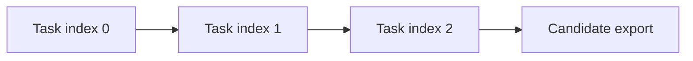
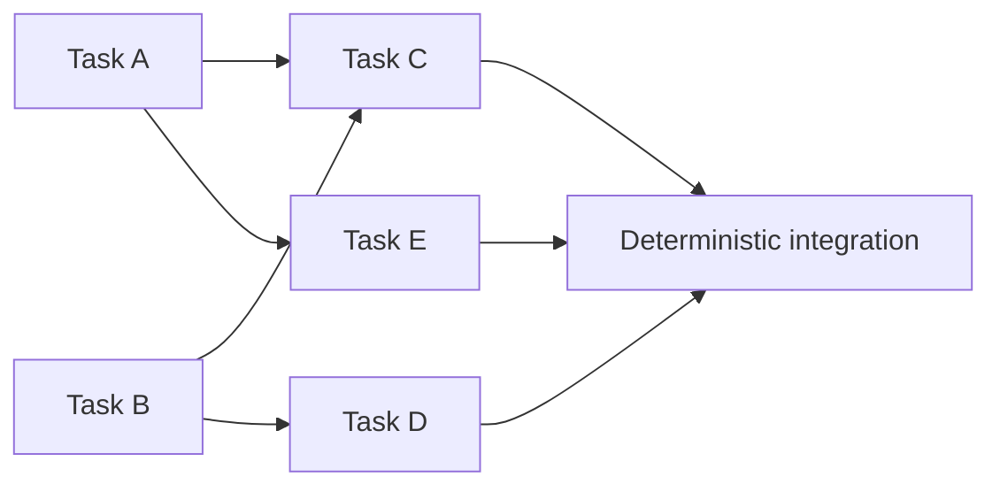
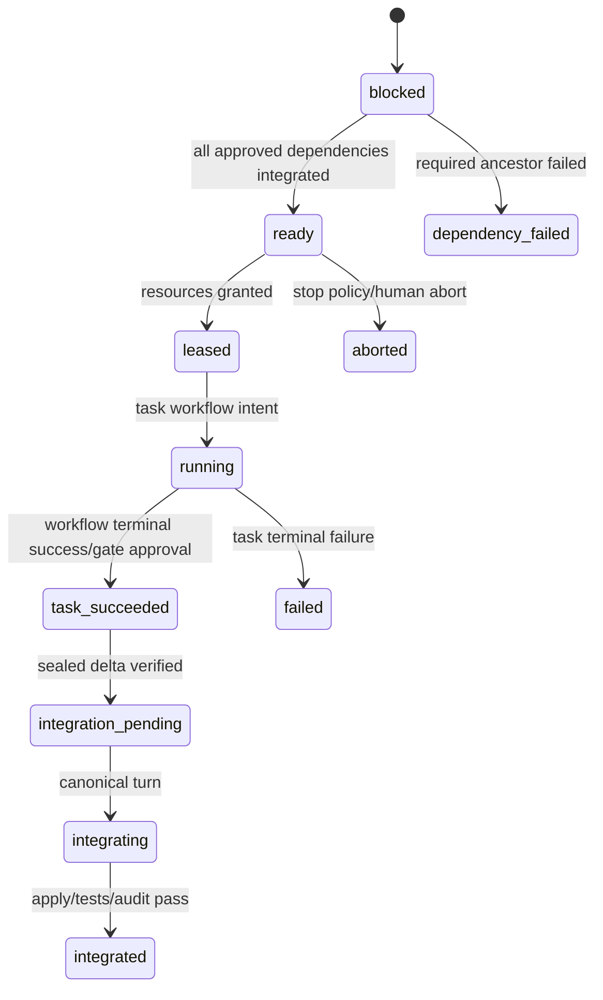

# Parallel campaign scheduler roadmap

Status: proposed design for `0.5.0`, not current capability. Version 0.2.0 campaigns
are synchronous and sequential: `ReplayCampaignSpecification.tasks` is an ordered
tuple and `replay_campaign_engine._drive` advances one
`ReplayCampaignState.current_task_index`. No parallel scheduling is currently
supported. Names marked **Proposed** do not exist in 0.2.0.

## Goals

- Represent a campaign as an explicit, strict, human-approved task DAG.
- Run independent Worker–Auditor pairs concurrently in isolated Git worktrees and
  branches, subject to deterministic path-conflict and resource rules.
- Preserve per-task deterministic state transitions, bounded repair loops, untrusted
  typed model reports, exact action proof, and conservative crash recovery.
- Integrate sealed task deltas in one deterministic order and run integration tests and
  fresh integration audits before candidate publication.
- Keep existing ordered campaign schema version 1 sequential and resumable.

## Non-goals

- Retrofitting parallel execution into existing schema-version-1 runs.
- Letting a Supervisor create binding dependencies, permissions, write paths, tests, or
  resource policy without explicit human approval.
- Shared writable workspaces, concurrent Workers on one branch, or Auditor access to a
  Worker's session.
- Distributed/multi-host scheduling, consensus, remote worktree storage, Kubernetes,
  autoscaling, preemption of external model calls, or a general build farm.
- Automatic semantic conflict resolution, model-authored merge resolutions, or
  non-deterministic “best effort” integration.
- Protected historical evaluation, candidate/gold inspection, live historical replay,
  or packaged-evaluator hardening.

## Current-to-target boundary

Current visible campaign execution is:



The target schedules only a human-approved ready set:



In this example A and B may run together only if declared path claims and resources are
compatible. C waits for both. Integration still uses one canonical serial order.

## Proposed explicit task DAG schema

Introduce **Proposed** `CampaignDagSpecification` as campaign schema version 2. The
root and nested models are strict/frozen with `extra="forbid"`; unknown fields,
duplicate keys, coercion, unsafe paths and duplicate normalized IDs fail before any
worktree or model action.

```yaml
schema_version: 2
campaign_id: synthetic-physics-upgrade
title: Independent implementation and validation tracks
visible_package_root: .
supervisor_policy_path: control/supervisor.md
backend_configuration_path: control/backends.yaml
baseline:
  repository_root: project
  commit: 2c26b46b68ffc68ff99b453c1d30413413422d70
dependency_authority:
  mode: manifest_human_approved
  approval_record_path: control/dag-approval.yaml
failure_policy: continue_independent
integration:
  branch_name: ras/integration/synthetic-physics-upgrade
  order: canonical_topological_then_task_id
  acceptance_test_ids: [integration-tests]
  audit_profile: code_and_configured_physics
resources:
  capacity:
    model_slots: 4
    cpu_slots: 8
    memory_mib: 16384
    gpu_slots: 0
tasks:
  - task_id: source-kernel
    title: Implement the bounded source kernel
    substage_specification_path: tasks/source-kernel/substage.yaml
    depends_on: []
    read_paths:
      - {path: src/shared, kind: tree}
      - {path: docs/conventions.md, kind: exact}
    write_paths:
      - {path: src/source, kind: tree}
      - {path: tests/source, kind: tree}
    resources:
      model_slots: 1
      cpu_slots: 2
      memory_mib: 2048
      gpu_slots: 0
  - task_id: boundary-kernel
    title: Implement the independent boundary kernel
    substage_specification_path: tasks/boundary-kernel/substage.yaml
    depends_on: []
    read_paths:
      - {path: src/shared, kind: tree}
      - {path: docs/conventions.md, kind: exact}
    write_paths:
      - {path: src/boundary, kind: tree}
      - {path: tests/boundary, kind: tree}
    resources:
      model_slots: 1
      cpu_slots: 2
      memory_mib: 2048
      gpu_slots: 0
  - task_id: coupled-check
    title: Add coupled source/boundary checks
    substage_specification_path: tasks/coupled-check/substage.yaml
    depends_on: [source-kernel, boundary-kernel]
    read_paths:
      - {path: src/source, kind: tree}
      - {path: src/boundary, kind: tree}
    write_paths:
      - {path: tests/coupled, kind: tree}
    resources:
      model_slots: 1
      cpu_slots: 2
      memory_mib: 2048
      gpu_slots: 0
```

### Fixed schema rules

- `depends_on` contains unique declared task IDs only.
- `PathClaim.kind` is `exact` or `tree`. V1 DAG claims reject glob metacharacters;
  finite exact/prefix intersection is therefore deterministic, including paths not yet
  created.
- A `tree` claim owns the named path and all descendants. `exact` owns one path.
- Read/write claims are safe normalized repository-relative paths, not the repository
  root, `.git`, run roots, control/protected authority, candidate/evaluation roots, or
  symlink traversals.
- Every substage `allowed_paths` must be covered by that task's `write_paths`; every
  declared contract/prompt/oracle path must be protected and cannot be a write claim.
- Resources are nonnegative bounded integers. A task request cannot exceed capacity.
- `failure_policy` is `stop_new_work` or `continue_independent`; the default is
  `stop_new_work` and is human-owned.
- Integration order is literal `canonical_topological_then_task_id` in v1.
- No generic `metadata`, custom scheduler expression, priority function, hook, shell
  command, or dynamic namespace exists.

## Supervisor-proposed versus human-approved dependencies

Two modes are explicit:

### Human-authored manifest

`dependency_authority.mode: manifest_human_approved` means the human authored the
`depends_on`, path and resource fields. A separate approval record still binds the
canonical graph hash, baseline and campaign ID before launch.

### Supervisor proposal

`dependency_authority.mode: supervisor_proposed` permits a read-only Supervisor to
produce one strict **Proposed** `DagProposal` from visible task descriptions and
human-declared path/resource envelopes. The proposal may choose dependencies only; it
cannot add/remove tasks, change paths/resources/contracts/tests/backends, or view
protected evaluation data.

The engine validates and canonicalizes the proposal, writes `dag-proposal.json`, and
enters **Proposed** `dependency_review_paused`. No worktree/model task action begins.
The human approves the exact hash:

```yaml
schema_version: 1
campaign_id: synthetic-physics-upgrade
baseline_commit: 2c26b46b68ffc68ff99b453c1d30413413422d70
canonical_graph_sha256: c5440640059659d2887de7f5c0be3d390f1d22355d9f9d03a6c64b5f8bf86e1b
decision: approve
reason: Dependencies and declared path ordering were reviewed.
```

`approve` freezes the graph. `reject` aborts before task launch. Editing a proposal
requires a new proposal/hash and approval; a note cannot mutate it. Approval identity
is an operator/audit concern, but the engine at minimum records exact decision bytes,
hash, time and graph binding. A Supervisor recommendation never becomes executable
authority by itself.

## Deterministic graph validation

Validation is model-free and ordered:

1. Load and hash the manifest, referenced substages, contracts, backend config and
   approval record within visible authority.
2. Normalize/sort task IDs, dependency lists and path claims; reject duplicates.
3. Require all dependency IDs to exist, no self-edge, and exact graph/approval hash.
4. Detect cycles with Kahn's algorithm using lexical task ID as the only tie-breaker.
   Persist the canonical topological order.
5. Compute transitive reachability deterministically.
6. For every task pair, intersect exact/tree claims:
   - write/write overlap requires reachability in one direction;
   - writer/reader overlap requires the reader to be reachable after the writer;
   - read/read overlap is allowed;
   - an overlap ordered both ways is already a cycle and rejected.
7. Verify each substage's allowed/protected paths and worktree repository identity
   against its task envelope.
8. Validate resource requests/capacity and role adapter capabilities.
9. Produce a canonical `validated-dag.json` containing sorted nodes/edges/claims,
   topological rank, reachability/path-conflict proofs and hashes—no prompt content.
10. Only then create task branches/worktrees or journal scheduling state.

An undeclared dependency discovered after launch is not auto-added. Pause the campaign,
discard no evidence, and require a new campaign/graph version.

## Declared write/read paths

Path declarations serve two distinct checks:

- scheduling independence before launch;
- actual changed-path enforcement after a Worker turn.

The existing `allowed_paths`/`protected_paths` and `git_evidence` remain authoritative
for actual changes. DAG `write_paths` are an outer envelope: a change must match both
the substage `allowed_paths` and the task claim. Declared `read_paths` are enforced by
worktree content construction and used for dependency validation; v1 does not claim to
kernel-enforce every file read by arbitrary tools.

If a task reads broadly (for example compiler metadata), declare the smallest stable
tree. If safe intersection cannot be expressed with exact/tree claims, serialize the
tasks with a dependency or split the task. Do not add a smarter open-ended glob solver.

Before and after every Worker/Auditor round, record Git identity and status. A Worker
change outside its double envelope routes through the existing scope repair/limit
policy. An Auditor or oracle workspace change is an integrity pause.

## Per-task worktrees and branches

**Proposed** `task_worktrees.py` owns lifecycle:

1. Validate one clean repository and exact baseline commit before campaign start.
2. Create one integration branch/worktree and one branch/worktree per task under a
   campaign-owned root disjoint from source, run, protected and candidate roots.
3. A root task starts at baseline. A dependent task starts from a deterministic
   dependency snapshot containing the already integrated sealed deltas of all ancestors
   in canonical order.
4. Branch names are deterministic and validated, for example
   `ras/task/<campaign-id>/<task-id>`. Existing branches/worktrees cause input failure;
   they are never overwritten.
5. Record worktree path, Git common-dir, branch, starting commit/tree, dependency delta
   hashes and creation intent/completion.
6. Run exactly one task's Worker–Auditor workflow in its worktree. No other task may
   write it.
7. On task success and required scientific approval, capture a sealed canonical change
   manifest/delta against its start tree. Do not integrate mutable branch state.
8. Retain worktrees for recovery/inspection by default. Cleanup is a separate explicit,
   validated, recoverable operation and not needed for 0.5 acceptance.

Symlinks/junctions are rejected at authority/worktree boundaries. This design must use
safe Git plumbing and explicit paths; it must never delete or reset broad user roots.

## Worker/Auditor isolation

Each task owns one pair boundary:

- Worker: exact task worktree, declared write envelope, provider session policy,
  workspace-write, no network, bounded shared repair counter.
- Code Auditor: fresh, read-only provider action in the same task worktree only after
  scope/tests pass.
- Physics Auditor when configured: fresh, read-only, after Code Auditor and fixed
  physics evidence, followed by the human scientific gate.
- Auditor scratch is action-owned and separate per action. Auditors never see Worker
  session IDs as resumable authority and never share scratch with one another.
- Prompts may include validated ancestor delta hashes and current task evidence, but not
  sibling worktree contents, sibling sessions, protected evaluation data, or mutable
  scheduler internals.
- A task's model cannot approve dependencies, acquire leases, integrate deltas, or
  publish a candidate.

## Resource leases

**Proposed** `ResourceLease` is durable, bounded and local:

```json
{
  "schema_version": 1,
  "lease_id": "lease-source-kernel-g000",
  "task_id": "source-kernel",
  "generation": 0,
  "owner_run_token": "0c9f...",
  "resources": {
    "model_slots": 1,
    "cpu_slots": 2,
    "memory_mib": 2048,
    "gpu_slots": 0
  },
  "state": "held",
  "acquired_at": "2026-01-01T00:00:00.000000Z",
  "owner_pid": 12345,
  "owner_boot_id_sha256": "6af8..."
}
```

The scheduler holds one campaign lock while selecting the ready set and journal-writing
lease grants, then task runners use per-task locks. Resource arithmetic uses sorted
task IDs and integer capacity only. No age/priority randomness exists. A task may start
only after its lease and action intent are durable.

Leases are not proof that a provider call stopped. After a crash, local PID/boot/lock
evidence can mark a lease owner absent, but the engine must first recover each pending
action from its adapter completion proof. If external completion is uncertain, the task
and campaign pause; the lease is not recycled into a duplicate action. Lease generation
increments only after a proven terminal task action or explicit human recovery.

## Scheduler states

Use a campaign state and one strict task state per node. Do not flatten concurrent
actions into the current single `current_task_index`.

### Proposed campaign states

```text
initialized
dependency_review_paused
ready
running
integration_running
integration_auditor_running
scientific_review_paused
human_paused
completed
failed
aborted
```

### Proposed scheduler task states

```text
blocked
ready
leased
running
task_succeeded
integration_pending
integrating
integrated
dependency_failed
failed
aborted
```

`running` references the task's versioned `WorkflowState`, whose existing Worker,
scope, tests, Auditor, repair and pause states remain authoritative. Scheduler state
does not duplicate or infer those transitions.



Every scheduler transition has an enumerated reason and hash-chained journal entry.
Status reads validate campaign journal, task journals, lease records, worktree identity,
sealed deltas and integration head before rendering.

## Ready-set selection and parallel launch

At each scheduling decision:

1. Reconcile durable campaign/task state and pending actions.
2. Mark a task ready only when every dependency is `integrated`, not merely
   `task_succeeded`.
3. Sort ready tasks by `(topological_rank, task_id)`.
4. Walk that order once, granting a task if its integer resources fit remaining
   capacity and no active claim conflicts exist. Because graph validation orders every
   write/read conflict, this second conflict check is an invariant assertion.
5. Journal all grants in sorted order, then launch up to the fixed worker-process limit.
6. Collect completions without using completion order for integration or later
   scheduling tie-breaks.

Concurrency changes wall-clock timing, not canonical task/integration order.

## Failure propagation

Failure is explicit and does not masquerade as a scientific result:

- input/graph/capability failure before launch: campaign `failed`, no task actions;
- task human/repair/scientific pause: campaign `human_paused` or
  `scientific_review_paused`; do not schedule descendants;
- task terminal failure/abort: mark all transitive descendants `dependency_failed` with
  the exact ancestor set;
- `stop_new_work`: stop granting new leases after the first failure; allow already
  running tasks to reach a safe pause/completion;
- `continue_independent`: tasks with no failed ancestor may continue; descendants never
  do;
- a sibling failure does not delete a successful sealed delta;
- integration conflict/test/audit failure pauses integration and blocks all tasks whose
  snapshots would depend on that integration head;
- transport/infrastructure failure remains distinct from code/physics finding;
- no failed/blocked/paused task is included in a completed candidate.

If policy cannot uniquely determine propagation, the campaign pauses for human review.
The human may abort or start a new approved graph; they cannot mutate dependencies in
the active run.

## Crash recovery

Recovery follows intent/proof principles already used by `workflow_engine`:

- journal intent before branch/worktree creation, lease grant, task launch, delta seal,
  integration apply, test, audit and candidate export;
- write action-specific completion records last and verify hashes before transition;
- reconcile snapshot from the hash-chained journal; never infer success from files
  alone;
- use exclusive campaign, task and integration locks;
- finalize a complete, verified action once;
- pause on an external action whose completion is uncertain; never blindly relaunch;
- verify frozen manifest/approval/backend/substage/contract hashes and repository
  identity on every resume;
- verify each task worktree branch/start tree/current tree, active lease owner, sealed
  delta, integration head and expected next canonical task;
- completion order from pre-crash processes does not change integration order;
- candidate staging/finalization retains the current rule forbidding later model
  action once export begins.

Crash injection points must cover every boundary above, including after a task finishes
but before resource release and after integration changes bytes but before its
completion journal entry.

## Deterministic integration

Never merge mutable task branches directly. Integrate sealed deltas:

1. Determine order from validated canonical topological order, then task ID for equal
   rank.
2. Verify the task start-tree and ancestor delta set match the graph snapshot.
3. Verify the sealed delta manifest and payload hashes.
4. In the single integration worktree, record apply intent and expected pre-apply tree.
5. Apply the canonical file-operation list (`add`, `modify`, `delete`) with exact modes
   and bytes. Reject path escape, symlink traversal, undeclared writes, existing-content
   mismatch or merge conflict. No model resolves it.
6. Record the post-apply tree/delta hash. If commits are created, freeze author,
   committer, message, parent and timestamp from campaign-owned deterministic values so
   identical inputs produce identical object IDs.
7. Run declared integration tests and a fresh integration Code Auditor; add Physics
   Auditor/human scientific gate if any integrated physics contract requires it.
8. Seal the accepted integration tree and mark the task `integrated`.
9. Create dependent worktrees only from the accepted integration snapshot that contains
   all their ancestors, applied in the same canonical order.

The final candidate exporter consumes only the final accepted integration tree and
per-task sealed provenance. It remains separate from protected evaluation.

## Integration audits

An integration audit is distinct from each task Auditor. It sees:

- frozen campaign and approved graph hashes;
- integration baseline and ordered sealed-delta manifests;
- complete combined patch;
- integration test results;
- declared cross-task invariants and path claims;
- per-task terminal audit summaries, not provider sessions;
- physics contract/oracle evidence when configured.

The Code integration Auditor is fresh/read-only and returns a strict typed report.
Its model verdict is untrusted and routed using the same deterministic prerequisites:
all applies proved, scope/path claims satisfied and integration tests passed. Repair is
not automatically assigned to an arbitrary task. A finding must identify exactly one
owning task and unambiguous sealed delta; otherwise pause for a human/new DAG.

Physics integration review cannot bypass the Physics Auditor human gate. Cross-task
convention, gauge/constraint, or interpretation questions always require human review.

## Synthetic DAG qualification suite

Use only generated repositories and deterministic fake adapters. Minimum cases:

| ID | Graph/case | Expected behavior |
|---|---|---|
| DAG-01 | Single node | Same task semantics as sequential workflow |
| DAG-02 | Two-node chain | B starts only after A integrates |
| DAG-03 | Two independent disjoint tasks | Both leased/run concurrently; integrate lexical order |
| DAG-04 | Diamond A→{B,C}→D | B/C parallel; D waits for both integrated |
| DAG-05 | Disconnected components | Independent progress follows failure policy |
| DAG-06 | Missing dependency/self-edge | Prelaunch validation failure |
| DAG-07 | Cycle of length 2 and length 4 | Prelaunch deterministic cycle rejection |
| DAG-08 | Unordered write/write overlap | Prelaunch validation failure |
| DAG-09 | Unordered write/read overlap | Prelaunch validation failure |
| DAG-10 | Ordered overlapping paths | Serialized and accepted |
| DAG-11 | Undeclared actual write | Existing scope repair/limit route |
| DAG-12 | Resource request over capacity | Prelaunch validation failure |
| DAG-13 | Ready set larger than capacity | Stable lexical grants; no starvation in finite suite |
| DAG-14 | One branch fails with `continue_independent` | Descendants blocked, disjoint branch completes |
| DAG-15 | One branch fails with `stop_new_work` | No new leases after failure; active tasks settle safely |
| DAG-16 | Crash at every lease/action boundary | Exact recovery or human pause, no duplicate action |
| DAG-17 | Crash during delta seal/integration | Hash proof recovery or pause; no double apply |
| DAG-18 | Deterministic apply conflict | Integration pause, no model merge |
| DAG-19 | Integration test failure | Integration pause; no candidate |
| DAG-20 | Integration Auditor failure | Bounded owner-specific repair or human pause |
| DAG-21 | Physics cross-task convention question | Mandatory scientific review |
| DAG-22 | Supervisor proposal without/mismatched approval | No worktree or task launch |
| DAG-23 | Same inputs under randomized completion timing | Identical integrated bytes/order/provenance |
| DAG-24 | Attempted protected/evaluation path claim | Prelaunch rejection and no model exposure |

The concurrency harness must prove overlap occurred for DAG-03/DAG-04 using controlled
barriers, without timing sleeps as the correctness assertion.

## Exact 0.5.0 acceptance gates

Release only if all gates pass:

1. Existing campaign schema-version-1 commands/runs remain sequential, readable and
   resumable with no journal rewrite or new parallel behavior.
2. Schema-version-2 DAG models reject unknown fields, unsafe paths, duplicate IDs,
   missing/self/cyclic edges, invalid resources, unordered path conflicts and approval
   hash mismatch before worktree/model launch.
3. Supervisor-proposed dependencies cannot launch until an exact human approval record
   is validated; a Supervisor cannot alter tasks, claims, resources or authority.
4. All 24 DAG cases pass on Linux using synthetic adapters/repositories.
5. DAG-03 and DAG-04 prove concurrent independent Worker–Auditor pairs with isolated
   worktrees, branches, sessions, scratches, artifacts and locks.
6. Completion timing permutations produce identical ready-set grant order, sealed-delta
   order, integrated bytes, test/audit order and candidate provenance.
7. Every actual change matches both task `write_paths` and substage `allowed_paths`;
   protected/evaluation roots remain inaccessible.
8. A task starts only from a hash-proved snapshot containing exactly its integrated
   ancestors in canonical order.
9. Resource capacity is never exceeded; one task generation has at most one live
   lease/action owner; uncertain external completion is never relaunched.
10. Crash injection at every lease, worktree, task, delta, integration, audit and export
    boundary yields exact-once finalization or a durable human pause.
11. Integration uses verified sealed deltas, not mutable branches; conflicts cannot be
    model-resolved or silently reordered.
12. Declared integration tests and fresh integration audits pass before candidate
    export. Physics integration conditions retain the required human scientific gate.
13. Failure propagation exactly matches the frozen policy and records failed ancestors;
    no descendant or incomplete task enters a completed candidate.
14. Backend capability negotiation occurs before task lease/action intent, and
    heterogeneous synthetic role configurations preserve per-role policies.
15. Full ordinary workflow, Physics Auditor, adapter conformance, documentation, Ruff,
    mypy, package build and installed synthetic smoke checks pass. No live campaign or
    protected historical replay is required.

## Module-level implementation map

| Proposed component | Existing 0.2.0 touchpoints | Required change |
|---|---|---|
| `CampaignDagSpecification` | `replay_campaign_models.py`, `replay_campaign_sources.py` | New strict schema v2; retain ordered v1 |
| DAG approval/proposal | `replay_campaign_prompts.py`, `SupervisorAction`, human decisions | Read-only proposal plus exact human hash approval |
| `campaign_scheduler.py` | `replay_campaign_engine._drive`, `ReplayCampaignState` | Ready set/task map instead of `current_task_index` for v2 only |
| Scheduler/task journals | `durable_state.py`, campaign `_event`, workflow journals | Hash-chained exact transitions and versioned semantics |
| `ResourceLease` | campaign locks and action intents | Durable local capacity/accounting and recovery |
| `task_worktrees.py` | `git_evidence.py`, baseline loading, candidate export | Safe per-task branch/worktree and sealed delta |
| Worker/Auditor pairs | `workflow_engine.py`, backend abstraction | One versioned workflow per task worktree |
| `campaign_integration.py` | `candidate_export.py`, test runner, workflow prompts | Canonical apply, tests, fresh audits, accepted tree |
| Failure/status CLI | `cli.py`, replay result formatting | DAG status, per-task states, human pauses |
| Qualification | `tests/test_replay_campaign.py`, workflow recovery tests | Synthetic concurrency, graph, lease and integration cases |

## Out of scope

- Implementing scheduler code in this documentation-only change.
- Parallelizing one Worker repair loop or running Worker and its Auditor concurrently.
- Multi-repository atomic integration in v1 of the scheduler; use one pinned repository
  per DAG campaign.
- Dynamic graph mutation, speculative execution, provider fallback, model priorities,
  semantic merge automation, or distributed leases.
- Deleting user worktrees/branches automatically.
- Protected evaluation access, live historical campaigns, or changing candidate
  evidence.
