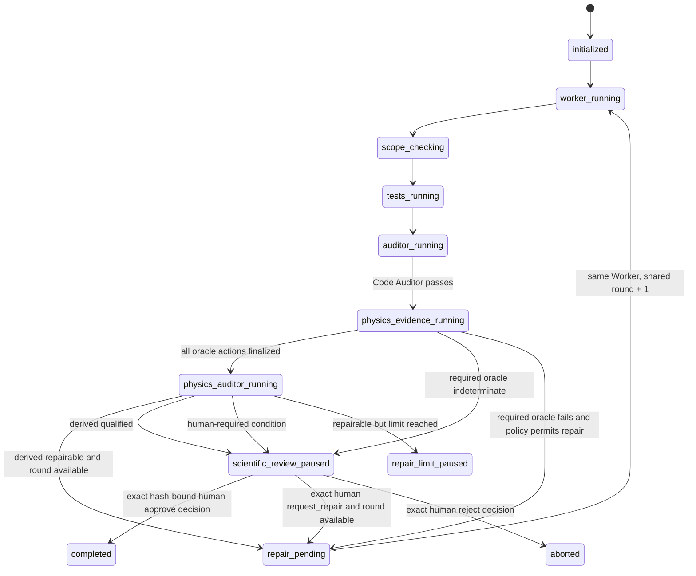

# Physics Auditor v1 roadmap

Status: PA-1 strict contract/report schemas, backward-compatibility fixtures, canonical
serialization, read-only validation CLI, and model-free deterministic routing are
implemented and qualified. PA-2 fixed trusted intents, isolated model-free oracle
execution, completion proofs, Git integrity, and separate crash recovery are also
implemented and qualified while the package remains `0.2.0`. Physics Auditor model
execution, workflow integration/state, repair, and scientific review remain proposed
for later stages targeted at `0.3.0`. Names still marked **Proposed** do not exist in
the current package.

## Goal

Add a distinct Physics Auditor that reviews a physics-enabled substage against a
frozen, structured physics contract and frozen deterministic evidence. Its report is a
strict, bounded, untrusted input. Engine code—not the model—validates the report,
derives the route, enforces the existing repair bound, and requires a human scientific
release decision.

Version 1 initially uses the current Codex transport and the current read-only,
ephemeral auditor policy. The physics contract, report, evidence identifiers, and
decision logic must contain no Codex-specific fields so 0.4 can select a different
adapter/model without changing scientific semantics.

## Non-goals

- Replacing the current Code Auditor or making it a scientific oracle.
- Proving a physical theory, choosing conventions, resolving gauge freedom, or
  inventing a physical interpretation.
- Allowing a model to add or modify acceptance tests, oracle commands, expected
  results, permissions, or path authority.
- Automatically releasing physics work without a human scientific gate.
- Adding arbitrary providers in 0.3.0, parallel scheduling, an open-ended metadata
  namespace, or provider-specific content in a physics report.
- Reading protected historical fixtures, gold, hidden tests, candidate payloads, or
  private evaluator evidence; replaying historical campaigns; or hardening the
  experimental packaged evaluator.
- General symbolic-algebra or numerical-infrastructure closure. V1 runs only
  human-authored, fixed, offline oracle commands in an already qualified project
  environment.

## Code Auditor versus Physics Auditor

`AuditorModelResult` is the current Code Auditor result even though the class is named
generically. Keep that class and its version-1 behavior unchanged.

| Concern | Current Code Auditor | **Proposed** Physics Auditor |
|---|---|---|
| Primary question | Does the change satisfy the frozen software contract after scope and fixed tests pass? | Is the physics implementation/evidence consistent with the explicit physics contract, conventions, invariants, and human-authored oracles? |
| Current type | `AuditorModelResult` / `AuditFinding` | **Proposed** `PhysicsAuditReport` / `PhysicsFinding` |
| Placement | After `scope_checking` and `tests_running` | After a passing Code Auditor, only for physics-enabled schema-version-2 substages |
| Workspace access | Fresh, ephemeral, Codex `read-only` plus action-owned scratch | Same in 0.3.0; provider-neutral required capabilities after 0.4.0 |
| Evidence | Contract, complete patch, Git scope, Worker result, fixed tests, prior audits | Physics contract, convention registry, current code/derivations, validated oracle results, Code Auditor result, complete patch and prior physics reports |
| Output authority | Advisory typed report; engine checks deterministic state | Untrusted typed observations; engine derives the physics decision |
| Repair | `fail_repairable` returns to the same persistent Worker within `max_repair_rounds` | Repairable, unambiguous physics defects use the same existing round counter and same Worker |
| Human boundary | Escalation, transport ambiguity, repair limit, checkpoint | Every physics release; mandatory immediately for convention changes, unresolved gauge/constraint questions, or new interpretations |
| Oracle | Model/human semantic judgment around fixed evidence | Human-authored analytic/symbolic/numerical oracle evidence; never the model itself |

Both auditors are required for a v1 physics substage. A Physics Auditor pass cannot
override failed scope, fixed tests, or Code Auditor state.

## Versioning and workflow compatibility

Use a discriminated loader rather than adding optional fields to strict
`SubstageSpecification` version 1:

- schema version 1: load the existing `SubstageSpecification` and run the exact 0.2.0
  state machine;
- **Proposed** schema version 2: load **Proposed** `PhysicsSubstageSpecification`,
  which contains the existing fields plus a required `physics_contract_path` and a
  required `physics_auditor` role block;
- use separate **Proposed** `PhysicsWorkflowState` schema version 2 and versioned
  journal semantic forms. Do not add new statuses to old state snapshots or rewrite
  old journals;
- existing CLI commands dispatch by the frozen specification/run-state version. No
  new behavior is inferred from filenames, paths, titles, or model output.

An ordinary non-physics substage remains schema version 1. A physics substage opts in
explicitly and cannot omit its physics contract.

## Proposed physics task-contract schema

### Design rules

**Proposed** `PhysicsTaskContract` is strict, frozen, and bounded:

- YAML root object, `schema_version: 1`, `extra="forbid"`, strict Pydantic types;
- unique identifiers use the existing `Identifier` shape;
- paths use existing safe relative-path normalization and must be inside the workspace;
- contract files inside the workspace must match `protected_paths`;
- no arbitrary `metadata`, `extensions`, executable snippets, expressions evaluated by
  the supervisor, or model-written fields;
- human-readable statements are bounded strings, not executable oracles;
- oracle commands are fixed shell-free argument vectors, like `WorkflowTest`;
- each invariant and oracle ID is unique, and all references must close over declared
  IDs before any model action;
- conventions are explicit fixed fields. `not_applicable` is explicit; omission is not
  interpreted as a default.

### Proposed typed fields

| Model/field | Type and constraint | Meaning |
|---|---|---|
| `PhysicsTaskContract.schema_version` | literal `1` | Physics-contract schema, independent of substage schema |
| `contract_id`, `title` | `Identifier`, bounded string | Frozen identity |
| `audit_profile` | literal `physics_implementation_v1` | Only release profile in 0.3.0 |
| `system_description` | bounded string | Human statement of physical system and approximation regime |
| `artifact_paths` | 1–100 safe relative paths | Code/derivation/data artifacts the audit may inspect |
| `conventions` | `PhysicsConventionRegistry` | Required units, signature, index, coordinate, normalization, Fourier and orientation choices |
| `equations` | 1–200 `PhysicsEquationContract` | Stable equation IDs and human-authored statements/source locators |
| `constraints` | 0–100 `PhysicsConstraintContract` | Gauge/algebraic/differential constraints and frozen resolution status |
| `invariants` | 1–200 `PhysicsInvariantContract` | Dimension, sign, limit, conservation, mapping, and numerical requirements |
| `oracles` | 1–100 `PhysicsOracleSpecification` | Fixed offline analytic/symbolic/numerical checks |
| `required_oracle_ids` | unique tuple of declared IDs | Oracles required for any derived qualified result |
| `human_gate_policy` | literal `required` in v1 | Prevents model-only scientific release |

`PhysicsConventionRegistry` has fixed fields:

- `unit_system`: `si`, `cgs`, `geometrized`, `natural`, or `other_frozen`;
- `metric_signature`: `minus_plus_plus_plus`, `plus_minus_minus_minus`,
  `euclidean`, or `not_applicable`;
- `index_position_rule`, `coordinate_system`, `normalization`, and
  `fourier_transform`: bounded human strings;
- `levi_civita_orientation`: `plus`, `minus`, or `not_applicable`;
- `constants`: a bounded tuple of `{id, symbol, value_text, dimensions_text}`. Values
  remain text and are not evaluated by the loader.

`PhysicsConstraintContract.status` is `frozen_resolved` or `human_unresolved`. A
contract containing `human_unresolved` is valid for investigation but can never route
to release without a recorded human resolution in a new, immutable contract version.
The model cannot turn it into `frozen_resolved`.

`PhysicsInvariantContract.kind` is a closed v1 enum:

- `dimensional_consistency`;
- `sign_and_factor`;
- `index_contraction`;
- `constraint_preservation`;
- `boundary_or_initial_condition`;
- `analytic_limit`;
- `conservation_or_balance`;
- `equation_to_code_mapping`;
- `numerical_tolerance`.

Each invariant includes `id`, `kind`, `statement`, `equation_ids`, `artifact_paths`,
`oracle_ids`, `failure_severity` (`critical`, `high`, `medium`, `low`), and
`repair_policy` (`automatic_if_unambiguous` or `human_required`).

`PhysicsOracleSpecification.kind` is `analytic`, `symbolic`, or `numerical` and has:

- `id`, `description`, `kind`;
- `argv`, `cwd`, `timeout_seconds`, `max_stdout_bytes`, `max_stderr_bytes` using the
  same bounds as `WorkflowTest`;
- `result_format: physics_oracle_result_v1`;
- `determinism`: `exact` or `tolerance_bound`;
- explicit `tolerance_text` (`not_applicable` for exact checks);
- `required_input_paths`, all within `artifact_paths` or protected contract authority;
- `scratch_required`, a boolean. Output may be written only in an action-owned scratch
  directory supplied by the engine.

The runner expects one bounded final JSON object on stdout. It does not interpret
arbitrary model prose or discover checks dynamically.

### Concrete YAML example

All names and values below are synthetic and illustrative.

```yaml
schema_version: 1
contract_id: gl-constraint-source-v1
title: GL source and constraint consistency
audit_profile: physics_implementation_v1
system_description: >-
  Check the frozen GL evolution source implementation in its documented approximation
  regime. Do not infer a different convention or physical interpretation.
artifact_paths:
  - docs/derivation/source_terms.md
  - src/evolution/source_terms.py
  - tests/physics/test_source_terms.py
conventions:
  unit_system: geometrized
  metric_signature: minus_plus_plus_plus
  index_position_rule: Spatial indices are raised with the frozen inverse spatial metric.
  coordinate_system: Frozen Cartesian chart used by the implementation.
  normalization: Source normalization is exactly the one stated in equation eq-source-1.
  fourier_transform: not_applicable
  levi_civita_orientation: plus
  constants:
    - id: c-light
      symbol: c
      value_text: "1"
      dimensions_text: geometrized dimensionless convention
equations:
  - id: eq-source-1
    statement: The implemented source term matches the frozen signed coefficient.
    source_path: docs/derivation/source_terms.md
    source_anchor: eq-source-1
constraints:
  - id: constraint-h
    kind: differential
    statement: The stated update must preserve the frozen constraint to truncation order.
    status: frozen_resolved
    resolution: Use the gauge and boundary conditions already recorded in this contract.
invariants:
  - id: inv-source-dimensions
    kind: dimensional_consistency
    statement: Every additive source contribution has the declared source dimensions.
    equation_ids: [eq-source-1]
    artifact_paths: [src/evolution/source_terms.py]
    oracle_ids: [oracle-symbolic-dimensions]
    failure_severity: high
    repair_policy: automatic_if_unambiguous
  - id: inv-constraint-limit
    kind: constraint_preservation
    statement: The zero-source analytic limit has the frozen residual.
    equation_ids: [eq-source-1]
    artifact_paths: [src/evolution/source_terms.py, tests/physics/test_source_terms.py]
    oracle_ids: [oracle-zero-source]
    failure_severity: critical
    repair_policy: human_required
oracles:
  - id: oracle-symbolic-dimensions
    description: Compare the frozen symbolic dimension vector for each additive term.
    kind: symbolic
    argv: [/usr/bin/python3, tools/physics/check_dimensions.py, --json]
    cwd: .
    timeout_seconds: 120
    max_stdout_bytes: 1048576
    max_stderr_bytes: 1048576
    result_format: physics_oracle_result_v1
    determinism: exact
    tolerance_text: not_applicable
    required_input_paths: [src/evolution/source_terms.py]
    scratch_required: false
  - id: oracle-zero-source
    description: Evaluate the public synthetic zero-source case and report residuals.
    kind: numerical
    argv: [/usr/bin/python3, tools/physics/zero_source_oracle.py, --json]
    cwd: .
    timeout_seconds: 300
    max_stdout_bytes: 1048576
    max_stderr_bytes: 1048576
    result_format: physics_oracle_result_v1
    determinism: tolerance_bound
    tolerance_text: residual_linf <= 1.0e-12 on the frozen synthetic case
    required_input_paths: [src/evolution/source_terms.py]
    scratch_required: true
required_oracle_ids: [oracle-symbolic-dimensions, oracle-zero-source]
human_gate_policy: required
```

### Proposed schema-version-2 substage excerpt

```yaml
schema_version: 2
substage_id: gl-constraint-source
title: GL constraint-source implementation
workspace: ../project
contract_path: ../project/control/software-contract.md
physics_contract_path: ../project/control/physics-contract.yaml
worker_initial_prompt_path: ../project/control/worker-initial.md
worker_repair_prompt_path: ../project/control/worker-repair.md
auditor_prompt_path: ../project/control/code-auditor.md
worker_model: gpt-5.6-sol
worker_reasoning_effort: high
worker_timeout_seconds: 1800
auditor_model: gpt-5.6-sol
auditor_reasoning_effort: high
auditor_timeout_seconds: 1800
physics_auditor:
  backend: codex
  model: gpt-5.6-sol
  reasoning_effort: high
  timeout_seconds: 1800
  prompt_path: ../project/control/physics-auditor.md
acceptance_tests:
  - id: unit-tests
    argv: [/usr/bin/python3, -m, pytest, -q]
    cwd: ../project
    timeout_seconds: 1800
    max_stdout_bytes: 10485760
    max_stderr_bytes: 10485760
allowed_paths: [src/**, tests/physics/**]
protected_paths: [control/**, tools/physics/**]
max_repair_rounds: 2
checkpoint_after: false
```

In 0.3.0 `physics_auditor.backend` accepts only literal `codex`. The nested shape is
intentional: 0.4.0 resolves the same role to a configured adapter. It is not a claim
that arbitrary backends currently work.

## Proposed typed oracle result

The non-model oracle process returns a strict **Proposed** `PhysicsOracleResult`:

```json
{
  "schema_version": 1,
  "oracle_id": "oracle-zero-source",
  "status": "passed",
  "summary": "Frozen zero-source residual is within tolerance.",
  "measurements": [
    {
      "id": "residual-linf",
      "value_text": "3.2e-14",
      "units_text": "dimensionless",
      "tolerance_text": "<= 1.0e-12",
      "within_tolerance": true
    }
  ],
  "evidence_paths": ["tests/physics/public_zero_source.json"]
}
```

`status` is `passed`, `failed`, or `indeterminate`. The engine checks that `oracle_id`
matches the intent, measurement IDs are unique, paths are declared and readable, all
strings and arrays are bounded, output is valid strict JSON, and the workspace Git
evidence is unchanged. The process exit status, stdout/stderr hashes, limits, timing,
and result hash are recorded like fixed-test evidence. A failed/indeterminate required
oracle prevents a qualified physics decision regardless of model report.

## Proposed typed audit-report schema

### Report fields

**Proposed** `PhysicsAuditReport` uses `schema_version: 1`, strict types,
`extra="forbid"`, maximum 200 checks/findings and existing bounded-string limits:

| Field | Type | Validation |
|---|---|---|
| `contract_id` | identifier | Exact match to frozen contract |
| `profile` | literal `physics_implementation_v1` | Exact match to contract |
| `summary` | bounded string | Informational only |
| `recommended_verdict` | `qualified`, `repairable`, `scientific_review` | Untrusted recommendation; never routed directly |
| `convention_status` | `unchanged`, `changed`, `unresolved` | `changed`/`unresolved` forces human review |
| `gauge_constraint_status` | `resolved_as_frozen`, `changed`, `unresolved` | `changed`/`unresolved` forces human review |
| `interpretation_status` | `no_new_interpretation`, `new_interpretation` | New interpretation forces human review |
| `checks` | tuple of `PhysicsInvariantAssessment` | Exactly one assessment for every declared invariant; no extra IDs |
| `oracle_assessments` | tuple of `PhysicsOracleAssessment` | Exactly one for every required oracle; evidence status must match engine-owned result |
| `findings` | tuple of `PhysicsFinding` | Unique IDs and closed category/disposition enums |
| `human_questions` | tuple of `PhysicsHumanQuestion` | Unique IDs; any item forces human review |

`PhysicsInvariantAssessment.outcome` is `satisfied`, `violated`, or `indeterminate`.
It includes declared `invariant_id`, `evidence_refs`, and bounded `rationale`.
Evidence references use typed IDs such as `oracle:oracle-zero-source`,
`test:unit-tests`, `equation:eq-source-1`, `artifact:src/evolution/source_terms.py`,
and `patch:<current-patch-sha256>`. The engine parses the prefix, validates the target,
and rejects missing, extra, or protected references. Free-form paths are not accepted
as evidence references.

`PhysicsFinding.category` is the same closed invariant vocabulary plus
`convention`, `gauge_or_constraint_ambiguity`, and `physical_interpretation`.
`disposition` is `repairable_unambiguous` or `human_required`. It includes optional
declared `invariant_id`, `equation_id`, and `artifact_path`, plus bounded `observed`,
`expected`, `evidence_refs`, and `required_action`.

### Concrete report example

```json
{
  "schema_version": 1,
  "contract_id": "gl-constraint-source-v1",
  "profile": "physics_implementation_v1",
  "summary": "One signed coefficient disagrees with the frozen equation and symbolic oracle.",
  "recommended_verdict": "repairable",
  "convention_status": "unchanged",
  "gauge_constraint_status": "resolved_as_frozen",
  "interpretation_status": "no_new_interpretation",
  "checks": [
    {
      "invariant_id": "inv-source-dimensions",
      "outcome": "violated",
      "evidence_refs": [
        "equation:eq-source-1",
        "oracle:oracle-symbolic-dimensions",
        "artifact:src/evolution/source_terms.py"
      ],
      "rationale": "The implemented coefficient changes the declared dimension vector."
    },
    {
      "invariant_id": "inv-constraint-limit",
      "outcome": "satisfied",
      "evidence_refs": ["oracle:oracle-zero-source"],
      "rationale": "The frozen residual remains within its declared tolerance."
    }
  ],
  "oracle_assessments": [
    {
      "oracle_id": "oracle-symbolic-dimensions",
      "recorded_status": "failed",
      "assessment": "agrees_with_oracle",
      "rationale": "The report finding follows the engine-owned failed result."
    },
    {
      "oracle_id": "oracle-zero-source",
      "recorded_status": "passed",
      "assessment": "agrees_with_oracle",
      "rationale": "No contradiction was found."
    }
  ],
  "findings": [
    {
      "id": "physics-finding-001",
      "severity": "high",
      "category": "dimensional_consistency",
      "disposition": "repairable_unambiguous",
      "invariant_id": "inv-source-dimensions",
      "equation_id": "eq-source-1",
      "artifact_path": "src/evolution/source_terms.py",
      "line": 84,
      "observed": "The source coefficient has the wrong frozen dimension vector.",
      "expected": "Match eq-source-1 under the unchanged convention registry.",
      "evidence_refs": ["oracle:oracle-symbolic-dimensions"],
      "required_action": "Correct only the signed coefficient and rerun all fixed evidence."
    }
  ],
  "human_questions": []
}
```

The recommendation is checked for consistency but not trusted. An inconsistent
recommendation makes the report invalid and pauses for a human; it never changes the
derived route.

## Audit profiles

0.3.0 exposes exactly one profile: `physics_implementation_v1`. It requires all of:

1. convention registry unchanged;
2. every equation-to-code mapping explicitly assessed;
3. every invariant assessed exactly once;
4. every required oracle completed and assessed;
5. dimensional/sign/index/constraint/limit checks declared by the contract;
6. no new physical interpretation;
7. Code Auditor, scope, and fixed tests already passed;
8. a human scientific release gate after model audit.

Later profile names and contracts are defined in
[physics research profiles](physics_research_profiles.md). They must not be accepted by
the 0.3.0 loader before implementation and qualification.

## Workflow placement

For schema version 2, retain current status names through the Code Auditor, then add
version-2-only statuses. Proposed statuses are bold in the diagram:



The actual new names are **Proposed** `physics_evidence_running`,
`physics_auditor_running`, and `scientific_review_paused`. Version-2 journal semantic
forms must enumerate every legal reason exactly, as the current
`JOURNAL_SEMANTIC_FORMS` does. The same `repair_round` and `max_repair_rounds` apply
across scope, fixed-test, Code Auditor, oracle, and Physics Auditor failures. There is
no second physics-only repair budget.

After any repair, the engine repeats scope evidence, all fixed tests, the Code Auditor,
all required physics oracles, and a fresh Physics Auditor. Prior evidence is retained
but never substituted for the current round.

## Read-only permission model

### Physics Auditor model

In 0.3.0 the Physics Auditor uses the existing Codex role policy:

- role `auditor`;
- `read-only` workspace sandbox;
- approval `never`;
- fresh and `--ephemeral`, never resumed;
- network/web disabled, user config/rules ignored;
- credential-shaped environment variables removed;
- only an action-owned `scratch/` directory is writable;
- prompt supplied on stdin and engine-owned JSON schema supplied with
  `--output-schema`;
- complete Codex artifacts verified before a report is copied into workflow evidence.

The Physics Auditor must not share the Worker session, current Code Auditor session, or
another physics round. A different backend after 0.4 must negotiate equivalent
`workspace_read_only`, `network_disabled`, `approval_never`, `structured_json_schema`,
`fresh_session`, and `scratch_write_only` capabilities or fail before action intent.

### Oracle processes

Oracle processes are deterministic tools, not model adapters. They receive a copied
credential-stripped environment, disabled network policy, fixed argv/cwd/limits, and
action-owned scratch paths. They must emit only their bounded result contract.

V1 additionally records Git evidence immediately before and after every oracle. Any
tracked, untracked, staged, branch, HEAD, or repository-identity drift is a hard
`scientific_review_paused` condition. This detects rather than claims kernel-enforced
read-only execution; adding a new namespace/sandbox hardening project is out of scope.
Oracle scripts and expected semantics are protected human authority and cannot be
inside `allowed_paths`.

## Evidence and oracle model

Evidence authority is ordered:

1. frozen human software contract and physics contract;
2. frozen convention/constraint registry;
3. deterministic Git baseline, complete patch and allowed/protected-path result;
4. fixed acceptance-test results;
5. fixed analytic/symbolic/numerical oracle results;
6. current Code Auditor report;
7. Physics Auditor report as untrusted typed observations;
8. immutable human scientific decision.

The Physics Auditor may inspect the current workspace directly and receive canonical
JSON summaries plus hashes. Prompt assembly follows `workflow_prompts._assemble`: exact
human source bytes, frozen contracts, canonical engine-owned evidence, canonical output
schema, and a fixed reporting instruction. Prompt text is not persisted; hashes and
handoff manifests are.

Every evidence reference must resolve to a frozen or engine-produced identifier. The
validator rejects unknown prefixes, undeclared oracles/invariants/equations, stale-round
action IDs, protected external locators, incomplete patches, mismatched hashes, or a
model claim that contradicts a recorded oracle status.

Oracle scope:

- analytic: exact limiting cases or identities implemented as human-authored checks;
- symbolic: fixed algebra, dimensions, contractions, coefficients, or signs;
- numerical: fixed public/synthetic inputs, convergence/residual/tolerance checks.

An oracle can be wrong; the model cannot repair that epistemic problem. Oracle/code
disagreement with plausible oracle defect, missing convention, or indeterminate result
routes to a human. Updating an oracle requires a new human-authored contract version and
a new run, never a Worker repair inside the current run.

## Deterministic verdict routing

**Proposed** `derive_physics_audit_decision(contract, oracle_results, report,
workflow_state)` returns a strict **Proposed** `PhysicsAuditDecision` with disposition
`repair`, `scientific_review`, or `qualified_for_human_gate`, plus fixed reason codes.

Apply these rules in order:

1. If scope, fixed tests, or Code Auditor state is not passing, treat the physics action
   as an invariant failure; no physics pass route exists.
2. If the report is invalid, incomplete, inconsistent, stale, or has unclosed evidence
   references, pause `scientific_review_paused` with
   `physics_report_invalid`. Do not retry the model automatically.
3. If the convention status is not `unchanged`, route `scientific_review` with
   `convention_change_or_ambiguity`.
4. If gauge/constraint status is not `resolved_as_frozen`, or the contract itself has a
   `human_unresolved` constraint, route `scientific_review` with
   `gauge_or_constraint_unresolved`.
5. If a new interpretation or any human question is present, route
   `scientific_review` with `physical_interpretation_or_question`.
6. If any required oracle is missing/indeterminate, contradicts its bound record, or
   the workspace changed during oracle execution, route `scientific_review` with an
   exact reason code.
7. If an invariant is `indeterminate`, or any finding is `human_required`, route
   `scientific_review`.
8. If an invariant is `violated` or a required oracle failed and every associated
   invariant permits `automatic_if_unambiguous`, every finding is
   `repairable_unambiguous`, and no human condition exists, derive `repair`.
9. Otherwise, require all invariants `satisfied`, all required oracles `passed`, zero
   findings, and a consistent `recommended_verdict: qualified`; derive
   `qualified_for_human_gate`.
10. Apply the shared repair bound. `repair` becomes `repair_pending` only when
    `repair_round < max_repair_rounds`; otherwise it becomes `repair_limit_paused`.

No report field can route directly to `completed`. Only a validated human decision at
the scientific gate can do so.

## Bounded repair-loop policy

- Reuse the exact persistent Worker session ID under current Codex behavior.
- Increment the existing `repair_round`; never reset or add a parallel counter.
- Construct the repair prompt only from validated findings, failed oracle identifiers,
  fixed contracts, and current deterministic evidence.
- Reject repair if it would change a convention, gauge/constraint resolution, oracle,
  permission, acceptance test, protected path, contract, or physical interpretation.
- One model transport failure is not automatically retried. It pauses using the same
  conservative current policy.
- After repair, rerun the full current-round path. A prior passing oracle or audit cannot
  be reused.
- At `max_repair_rounds`, write an immutable escalation package and pause. Human
  continuation may request another Worker round only through the existing explicit
  continuation mechanism and the version-2 scientific decision policy.

## Human scientific gate

Every physics substage reaches **Proposed** `scientific_review_paused` before release.
The engine writes a hash-pinned review packet containing contracts/hashes, convention
status, scope/test/code-audit summaries, oracle result records, physics report,
deterministic decision, patch identity, and unresolved questions. It excludes secrets,
protected evaluation material, and raw model prompt content.

The human supplies one immutable **Proposed** `PhysicsReviewDecision`:

```yaml
schema_version: 1
run_id: gl-constraint-source-0123456789abcdef
physics_report_sha256: 2ad1c7d3f06d0b327f7434547dbd03de5a2897a3601a3d86cbb4d36ef37c7424
decision: approve
reason: Reviewed conventions, constraints, oracle evidence, and implementation mapping.
resolved_question_ids: []
```

`decision` is `approve`, `request_repair`, or `reject`:

- `approve` is accepted only for a derived `qualified_for_human_gate`, exact report
  hash, unchanged frozen inputs/repository, and no unresolved question IDs;
- `request_repair` requires a separate exact human continuation instruction and an
  available repair round; it cannot modify frozen authority;
- `reject` produces a durable `aborted` terminal state, not a scientific failure claim.

Convention changes, unresolved gauge/constraint questions, and new physical
interpretations cannot be resolved by checking an ID in the same run. They require a
new or revised human contract and a new run. This is a hard release rule.

## Seeded-defect qualification suite

Use only public, synthetic mini-systems with known human-authored contracts. The fixed
minimum suite has 16 cases:

| ID | Seed | Required derived route |
|---|---|---|
| PA-01 | Clean equation-to-code mapping and all oracles pass | qualified for human gate |
| PA-02 | Wrong sign | repair |
| PA-03 | Missing factor | repair |
| PA-04 | Dimensional mismatch | repair |
| PA-05 | Incorrect index contraction | repair when contract marks unambiguous |
| PA-06 | Boundary/initial condition mismatch | repair |
| PA-07 | Failed analytic zero-source limit marked human-required | scientific review |
| PA-08 | Numerical residual above frozen tolerance | repair or review exactly as invariant policy declares |
| PA-09 | Convention changed in code/report | scientific review |
| PA-10 | Unresolved gauge/constraint question | scientific review |
| PA-11 | New physical interpretation | scientific review |
| PA-12 | Oracle indeterminate or malformed | scientific review; no model launch if evidence cannot finalize safely |
| PA-13 | Model says qualified while an oracle failed | invalid report, scientific review |
| PA-14 | Unknown/stale evidence reference | invalid report, scientific review |
| PA-15 | Repairable defect at exhausted limit | repair-limit pause |
| PA-16 | Oracle mutates tracked or untracked workspace state | scientific review and integrity reason |

For PA-02 through PA-06, qualification includes one seeded repair that fixes the defect,
then proves that all scope/tests/code audit/oracles/physics audit rerun. It also includes
the inverse test: a repair that changes a protected convention or oracle must be caught
by existing scope/frozen-input checks.

Model-free tests must cover every schema boundary, duplicate ID, extra field, unsafe
path, cross-reference mismatch, report inconsistency, routing precedence, repair count,
human decision hash mismatch, crash boundary, and version-1 compatibility case. Model
adapter tests use deterministic doubles only; no live provider is required for release.

## Initial GL-with-AI pilot tasks

These are **Proposed** task shapes, not claims about current GL-with-AI contents. The
human physics owner must supply exact equations, conventions, tolerances, source paths,
and meanings before a pilot. Do not infer what “GL” expands to or reuse protected
historical material.

1. `gl-units-and-signs`: audit dimensional consistency, coefficients, and sign
   conventions for one small source-term path with an exact symbolic oracle.
2. `gl-equation-code-trace`: audit a bounded derivation-to-implementation mapping,
   requiring every declared equation ID to map to named code lines and tests.
3. `gl-constraint-limit`: audit one frozen gauge/constraint statement and one analytic
   zero-source or symmetry limit. Any ambiguity is a human gate.
4. `gl-numerical-residual`: audit a small public/synthetic numerical case with a fixed
   residual/convergence tolerance and no performance claim.
5. `gl-convention-guard`: seed an attempted convention change and prove that the engine
   routes to human review instead of repair or completion.

Start with tasks 1 and 5 because they exercise the core safety distinction. Add task 2
only after evidence references and source anchors are stable; add numerical work last.

## Staged implementation checklist

PA-1 is implemented as the deliberately model-free subset documented in
[Physics Auditor PA-1 foundations](../physics_auditor_foundations.md). PA-2 separately
qualifies only the Stage C substrate documented in
[Trusted Physics Oracle execution](../physics_oracle_execution.md). Stages D and E
remain unavailable, and neither stage claims the complete `0.3.0` acceptance gates.

### Stage A: freeze compatibility

- [x] Capture current schema-version-1 load, prompt-hash, transition, action-record,
  recovery, repair-limit, CLI and package-build regression fixtures.
- [x] Confirm old workflow runs dispatch to unchanged v1 models and integrity code.
- [x] Document the exact existing `AuditorModelResult` as Code Auditor behavior.

### Stage B: models and deterministic decision

- [ ] Add **Proposed** `physics_models.py` with all strict contract/report/oracle/review
  types and closed enums.
- [ ] Add cross-reference closure and protected-path validation before any action.
- [x] Generate and validate a production-compatible JSON schema through existing
  `structured_outputs` rules.
- [x] Implement and exhaustively unit-test `derive_physics_audit_decision` without any
  model or subprocess.

### Stage C: oracle evidence

- [x] Add fixed shell-free oracle intents, bounded logs/results, completion records,
  action IDs and hashes.
- [x] Strip credential-shaped environment names, disable network policy, supply only
  action scratch, and record before/after Git identity.
- [x] Add crash recovery that finalizes a proved completion once and pauses on uncertain
  execution.

### Stage D: Physics Auditor action

- [ ] Add deterministic prompt assembly and a distinct physics output schema.
- [ ] Invoke current Codex with the existing read-only fresh-auditor policy.
- [ ] Record a distinct action kind/report proof without weakening current Codex
  artifact verification.
- [ ] Ensure Physics Auditor evidence never includes protected evaluation paths/content.

### Stage E: state routing and human gate

- [ ] Add version-2-only statuses and exact journal semantic forms.
- [ ] Connect Code Auditor pass to physics evidence; connect repair to the same Worker
  and same bound.
- [ ] Add immutable scientific review packet and strict human decision handling.
- [ ] Prove no path from a model report leads directly to `completed`.

### Stage F: qualification and docs

- [ ] Pass all 16 seeded cases and crash variants.
- [ ] Pass unchanged ordinary-substage and current Codex adapter tests.
- [ ] Add CLI help/examples clearly marked physics-only and versioned.
- [ ] Update user/architecture/security docs only after the gates below pass.

## Exact 0.3.0 acceptance gates

Release 0.3.0 only if all gates pass:

1. `pyproject.toml` and package `__version__` agree on `0.3.0`; wheel and sdist build,
   install, and run the synthetic ordinary quick start.
2. Every current schema-version-1 ordinary substage regression has identical normalized
   inputs, role policies, prompt hashes, action IDs, legal transition sequence, repair
   bound, status/exit behavior, and resumability unless an explicitly reviewed
   security fix says otherwise.
3. Old schema-version-1 state/journal/action evidence remains readable without rewrite.
4. The physics contract and report reject unknown fields, coercion, duplicate IDs,
   unsafe paths, undeclared references, and non-production JSON schema forms before
   routing.
5. All 16 PA cases produce the required deterministic route; every routing branch has a
   model-free unit test.
6. PA-02 through PA-06 prove a full post-repair rerun and the same persistent Worker
   identity; fresh Code and Physics Auditor identities are used every round.
7. A required oracle that is missing, malformed, indeterminate, stale, contradictory,
   or workspace-mutating can never yield qualified/completed state.
8. A report recommendation alone cannot affect state. Tests mutate each recommendation
   against identical checks/findings and prove fail-closed behavior.
9. Convention `changed`/`unresolved`, gauge/constraint `changed`/`unresolved`, any new
   interpretation, or any human question always reaches the scientific gate and never
   automatic repair/completion.
10. No physics substage reaches `completed` without an exact hash-bound human `approve`
    decision over a derived qualified result.
11. Repair uses the one existing `max_repair_rounds` counter. Limit exhaustion pauses;
    no automatic transport or scientific retry occurs.
12. Physics Auditor execution is fresh, ephemeral, read-only, approval-never,
    network-disabled, secret-stripped, schema-constrained, and allowed to write only its
    action scratch. Durable proof verifies those facts under current Codex semantics.
13. Crash injection at every new intent/completion/journal/review-decision boundary
    either recovers exactly once from durable proof or pauses without repeating an
    uncertain action.
14. Qualification uses only synthetic/public fixtures. A test scans prompts and
    artifacts to prove no configured protected evaluation root or sensitive value is
    present.
15. The public README and docs distinguish current 0.2/0.3 behavior from later adapter,
    DAG, and research-profile plans; all relative links pass `test_documentation.py`.
16. Ruff, mypy, the complete synthetic/unit suite, documentation tests, package build,
    and installed-package smoke test pass on the release commit. No live campaign,
    protected replay, or release tag is part of this gate.

## Future compatibility with another model/backend

Physics types use only domain IDs, paths, evidence references, outcomes, and bounded
text. They do not include `thread_id`, Codex events, CLI flags, reasoning-effort
assumptions, or provider error payloads.

In 0.4.0:

- translate `physics_auditor.backend: codex` to the Codex compatibility adapter;
- resolve role-specific backend/model configuration before journal intent;
- require normalized capabilities for read-only workspace, disabled network, fresh
  session, strict JSON-schema output, bounded output, secret hygiene, and scratch-only
  write;
- persist normalized `adapter_id`, `backend_id`, `model_id`, capability fingerprint,
  request hash, result status, and artifact hashes in the action proof;
- keep provider-native session/event evidence in an adapter-owned subrecord;
- run the same seeded suite against every candidate Physics Auditor backend using
  deterministic conformance doubles before any optional live qualification.

A backend without native JSON-schema enforcement may not claim the capability merely
because the engine can parse JSON afterward. It may be usable only if the role's
required capability policy explicitly allows engine validation; Physics Auditor v1
should require native or conformance-proved structured output and fail closed.

## Module-level implementation map

| Proposed change | Existing 0.2.0 touchpoints | Required constraint |
|---|---|---|
| `PhysicsTaskContract`, `PhysicsAuditReport`, `PhysicsAuditDecision` | `workflow_models.py`, `contract.py`, `structured_outputs.py` | Strict/versioned; no change to current models |
| `PhysicsSubstageSpecification` | `load_substage_specification`, `PreparedSubstage` | Discriminated schema v2; v1 path exact |
| Physics JSON schemas/prompts | `workflow_prompts.py`, `RenderedWorkflowPrompt`, `write_output_schemas` | Canonical append-only assembly; no prompt persistence |
| Oracle runner/proof | `test_runner.py`, `PendingAction`, `workflow_integrity.py`, `git_evidence.py` | Fixed argv, bounded, credential-free, crash-aware, drift-detecting |
| Physics Auditor Codex launch | `CodexInvoker`, `_prepared_codex_request`, `run_prepared_codex` | Current auditor policy; distinct typed report |
| Physics state machine | `WorkflowStatus`, `WorkflowState`, `_drive_unchecked`, `_transition`, `JOURNAL_SEMANTIC_FORMS` | Version-2-only statuses and exact semantic forms |
| Repair prompt | `build_audit_repair_prompt`, `_queue_or_limit_repair` | Same Worker/session/counter; only validated evidence |
| Human scientific decision | `continue_substage`, `_pause`, escalation records, CLI | Hash-bound immutable decision; no authority mutation |
| Durable proof | `PendingAction`, `CodexActionRecord`, `JournalEntry`, `_validate_journal_semantics` | Intent-before-action, completion-after-proof, uncertain pause |
| Tests | `tests/test_workflow_models.py`, `test_workflow_engine.py`, `test_workflow_recovery_integrity.py`, `test_codex_adapter.py` | Synthetic seeded defects and unchanged v1 suite |

## Out of scope

- Implementing the described modules in this documentation change.
- Treating the Physics Auditor, Code Auditor, Supervisor, or Worker as a truth source.
- Automatically changing conventions, gauges, constraints, tolerances, interpretations,
  contracts, tests, permissions, or oracle definitions.
- Broad derivation/claim-ledger profiles before 0.6.0.
- Parallel task execution before the 0.5.0 scheduler.
- Live GL-with-AI work until human owners author and approve complete public contracts.
- Protected historical qualification or any exposure of evaluator/gold data to a model.
