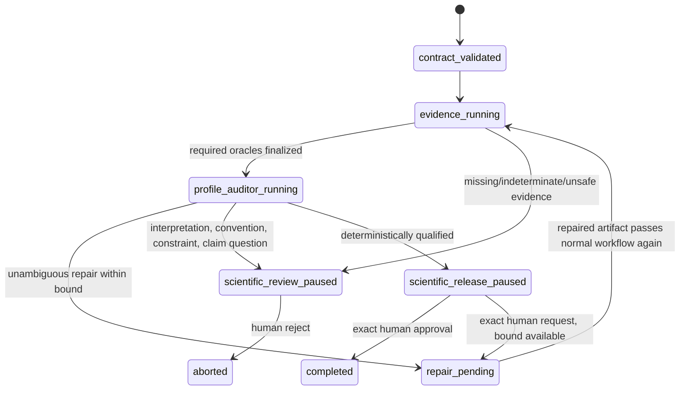
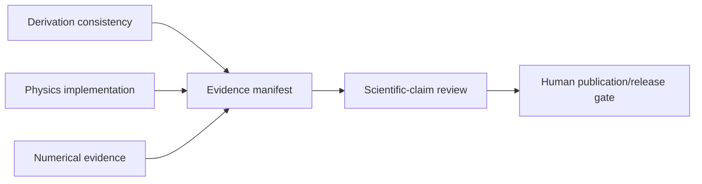

# Later physics research profiles

Status: proposed post-Physics-Auditor expansion, targeted no earlier than `0.6.0`.
Version 0.2.0 now contains the qualified PA-1 `physics_implementation` contract,
untrusted audit-report, policy and model-free routing foundations in addition to the
general `AuditorModelResult`. It does not execute a Physics Auditor or integrate the
profile into a live workflow. The additional profiles below are not current
capabilities. Names marked **Proposed** do not exist in 0.2.0.

## Purpose

Extend the strict contract/evidence/report vocabulary proven by
[Physics Auditor v1](physics_auditor_v1.md) to later research work without turning a
model into a scientific oracle. Each profile is explicit, closed and versioned. Human
owners freeze conventions, claims, oracles, tolerances and release gates; deterministic
code validates evidence and routes untrusted typed reports.

## Shared principles

- Every task selects exactly one implemented profile version. Unknown/future profile
  names are rejected.
- The human physics contract remains authoritative. Model reports cannot modify
  equations, conventions, constraints, claim wording, oracle definitions, tolerances,
  permissions, tests, or dependency authority.
- Analytic, symbolic and numerical oracles are fixed human-authored tools/results, not
  model opinions.
- Every reported conclusion references closed typed evidence IDs. Unknown or stale
  references invalidate the report.
- “Supported,” “contradicted,” and “inconclusive” describe evidence under a frozen
  contract; they do not prove universal physical truth.
- Convention changes, unresolved gauge/constraint questions and new physical
  interpretations always require a human and a new/revised contract when authority
  changes.
- Every profile has a required human release gate. Models may recommend but never
  release.
- Protected evaluation data remains outside every model process and prompt.
- No arbitrary `extensions`, evaluator hooks, executable expressions, or open-ended
  profile namespaces are added.

## Profile lifecycle



Profiles reuse the same versioned workflow journal, intent/completion proof, fresh
read-only Auditor, shared repair count and conservative recovery. They do not create
independent unbounded loops.

## Derivation consistency profile

**Proposed** profile ID: `derivation_consistency_v1`.

### Goal

Review a bounded derivation for internal consistency and traceability under frozen
definitions and conventions. This profile does not establish that the starting theory
or physical interpretation is correct.

### Required contract content

- ordered derivation-step IDs;
- input assumptions and domain-of-validity statements;
- symbol registry with index type, dimensions and definition source;
- convention registry;
- equation IDs and allowed dependency edges between equations;
- declared transformations per step from a closed enum:
  `substitution`, `algebraic_rearrangement`, `differentiation`, `integration`,
  `index_operation`, `approximation`, `limit`, `boundary_application`;
- approximation order and dropped-term policy;
- gauge/constraint status;
- required analytic/symbolic oracles;
- claim IDs, if a derivation supports later scientific claims.

### Required checks

- every used symbol is declared and consistently dimensioned;
- equation dependency graph is acyclic and every reference closes;
- index valence/range/contraction and sign/factor conventions remain fixed;
- transformations preserve stated equality/approximation semantics;
- discarded terms match the declared order and domain;
- boundary/initial/gauge/constraint substitutions are explicit;
- limiting cases and declared identities match fixed oracles;
- the final expression traces to declared inputs with no hidden assumption.

### Typed assessment

Each **Proposed** `DerivationStepAssessment` includes `step_id`, outcome
`consistent|inconsistent|indeterminate`, `input_equation_ids`, `output_equation_id`,
`assumption_ids`, `evidence_refs`, and rationale. An approximation, gauge choice or
boundary application that is not frozen is always `indeterminate` and routes to human
review, never automatic repair.

### Human gate

Required for every release. A human must explicitly review all assumptions,
approximations, convention status, gauge/constraint status, and the relationship
between mathematical consistency and physical applicability. Any new assumption,
domain, interpretation or convention requires a new contract.

## Physics implementation profile

Profile ID planned first in 0.3.0: `physics_implementation_v1`.

### Goal

Trace frozen equations/invariants into code and fixed tests/oracles. It is the bridge
between the current Code Auditor and later research profiles.

### Required checks

- dimensions, signs, factors, indices and normalizations;
- equation-to-code traceability;
- boundary/initial condition implementation;
- gauge/constraint preservation under the declared regime;
- analytic limits and conservation/balance relations;
- numerical tolerance checks declared by the contract;
- no convention, oracle or interpretation drift.

### Later extensions after v1

Possible reviewed schema versions may add multi-file mapping graphs, generated-code
provenance, discretization stencils, or coupled-component interfaces. Each must use a
closed new schema/profile version; do not add a generic metadata field to v1.

### Human gate

Required for all physics implementation release. Convention/gauge/constraint and new
interpretation conditions require contract revision, not a same-run checkbox.

## Numerical evidence profile

**Proposed** profile ID: `numerical_evidence_v1`.

### Goal

Assess whether frozen numerical experiments support a bounded claim under declared
methods, tolerances and environments. It does not infer a theory from data or treat a
plot/model narrative as an oracle.

### Required contract content

- dataset/input IDs and immutable hashes; only public/synthetic/model-readable inputs;
- executable/version/environment provenance already qualified by the human owner;
- parameter grid and seed policy;
- discretization, precision, solver and stopping criteria;
- expected convergence order or tolerance bounds;
- error norms and aggregation rules;
- baseline/comparator identities;
- required numerical oracle IDs;
- plot/table generation specifications with data-source IDs;
- claim-ledger IDs supported by each experiment;
- explicit exclusions and domain of validity.

### Required checks

- exact input/provenance identity and no undeclared data;
- deterministic seed/parameter coverage;
- solver termination distinguished from physical/numerical failure;
- convergence/resolution study completeness;
- residual, conservation and error bounds;
- sensitivity/robustness checks declared by the human contract;
- table/plot values trace exactly to recorded measurements;
- no cherry-picking relative to the frozen parameter grid;
- infrastructure failure, numerical contradiction and inconclusive evidence remain
  distinct outcomes.

### Typed numerical result example

```json
{
  "schema_version": 1,
  "experiment_id": "public-wave-convergence",
  "status": "completed",
  "input_manifest_sha256": "b365efdad15816a2d840722cb0e06fa2bafc173878e0311bc70fc0666de49316",
  "measurements": [
    {
      "id": "observed-order-l2",
      "value_text": "1.98",
      "units_text": "dimensionless",
      "acceptance_text": ">= 1.90",
      "within_acceptance": true
    }
  ],
  "claim_ids": ["claim-second-order-regime"],
  "artifact_refs": ["table:convergence-table-v1"]
}
```

Numeric values remain canonical strings paired with human-authored acceptance text;
the oracle runner computes the boolean using reviewed deterministic code. The model
cannot reinterpret a tolerance after seeing results.

### Human gate

A human reviews environment qualification, parameter coverage, tolerances, numerical
pathology, negative/inconclusive runs, and claim scope. New performance, stability,
universality, extrapolation or physical-interpretation claims require an updated claim
ledger and new approval.

## Scientific-claim review profile

**Proposed** profile ID: `scientific_claim_review_v1`.

### Goal

Review whether a frozen manuscript/document claim is traceable to the approved
derivation, implementation and numerical evidence. This is claim-evidence bookkeeping
and contradiction detection, not autonomous peer review or truth certification.

### Required contract content

- a strict claim ledger;
- document paths and stable claim anchors;
- evidence manifests from qualified derivation/implementation/numerical profile runs;
- allowed scope/strength vocabulary;
- declared assumptions, domain and limitations;
- citation records supplied by the human owner if relevant. V1 does not browse or add
  citations;
- required human reviewers/gates.

### Required checks

- every reviewed claim has one ledger entry and stable document anchor;
- every supporting/contradicting evidence reference closes and is current;
- claim strength does not exceed evidence status or domain;
- limitations and assumptions are represented near the claim as required by contract;
- quantitative values match exact table/oracle evidence;
- negative and inconclusive evidence is not omitted;
- convention or interpretation differences across evidence are surfaced;
- citations are not fabricated or model-added.

### Human gate

Always required. The human owns wording, novelty, significance, interpretation,
citations, and publication/release. A model may flag overstatement but cannot approve a
scientific claim for publication.

## Proposed claim ledger

### Schema

**Proposed** `ClaimLedger` is a strict standalone YAML/JSON contract:

| Field | Constraint |
|---|---|
| `schema_version` | literal `1` |
| `ledger_id` | unique identifier |
| `document_paths` | bounded safe relative paths |
| `claims` | 1–500 unique `ClaimRecord` entries |
| `evidence_manifests` | bounded IDs, safe locators and SHA-256 hashes |
| `human_gate_policy` | literal `required` |

Each `ClaimRecord` has:

- `claim_id`, `document_path`, `anchor`, and exact human-authored `statement`;
- `claim_kind`: `definition`, `derivation_result`, `implementation_behavior`,
  `numerical_result`, `comparison`, `limitation`, or `interpretation`;
- `strength`: `descriptive`, `bounded_support`, `demonstrated_under_contract`, or
  `interpretive`;
- `assumption_ids`, `convention_ids`, `domain_statement`;
- `supporting_evidence_refs`, `contradicting_evidence_refs`,
  `inconclusive_evidence_refs`;
- `required_profile_run_ids` and their manifest hashes;
- `release_status`: `draft`, `human_review_required`, or `human_approved`.

`human_approved` is valid only in a separate exact hash-bound human decision; a
model report cannot emit it as authority. Interpretation claims always require explicit
human review even when all cited evidence is qualified.

### Example

```yaml
schema_version: 1
ledger_id: gl-public-pilot-claims-v1
document_paths: [docs/results.md]
evidence_manifests:
  - evidence_id: numerical-run-public-wave
    path: evidence/public-wave/manifest.json
    sha256: b365efdad15816a2d840722cb0e06fa2bafc173878e0311bc70fc0666de49316
claims:
  - claim_id: claim-second-order-regime
    document_path: docs/results.md
    anchor: claim-second-order-regime
    statement: The frozen public test exhibits second-order convergence over the declared grid range.
    claim_kind: numerical_result
    strength: demonstrated_under_contract
    assumption_ids: [assumption-smooth-public-input]
    convention_ids: [convention-grid-spacing]
    domain_statement: Only the frozen public input and declared three-resolution range.
    supporting_evidence_refs:
      - numerical:numerical-run-public-wave/observed-order-l2
    contradicting_evidence_refs: []
    inconclusive_evidence_refs: []
    required_profile_run_ids: [numerical-run-public-wave]
    release_status: human_review_required
human_gate_policy: required
```

The engine validates manifest hashes, profile completion and evidence IDs. It does not
evaluate the prose as a mathematical oracle.

## Analytic, symbolic and numerical oracles

All profiles reuse the v1 oracle envelope and add kind-specific strict result unions.

### Analytic oracles

Appropriate for human-authored exact identities, symmetry reductions, limiting cases,
known solutions, conservation/balance identities and boundary behavior. Results
identify the exact case and return `passed|failed|indeterminate` plus closed
measurement/identity IDs.

Analytic statements themselves remain human contract text. A model-generated
derivation is not an analytic oracle.

### Symbolic oracles

Appropriate for algebraic equality, differentiation, tensor index structure,
dimensional vectors, series order, coefficients and sign checks. The contract pins
symbol assumptions, simplification rules, tool/version and canonical comparison form.

A symbolic tool timeout, unsupported assumption or noncanonical expression is
`indeterminate`, not evidence that code/derivation failed.

### Numerical oracles

Appropriate for tolerance-bounded residuals, convergence, stability indicators,
conservation error and fixed public/synthetic comparisons. The contract pins inputs,
precision, seeds, grids, norms, tolerances, aggregation and environment provenance.

Infrastructure failure, nonconvergence, out-of-tolerance and indeterminate output are
different typed states. The model cannot change tolerances or discard runs.

### Cross-oracle rules

- Every oracle ID is declared before the run and maps to one kind.
- Commands are fixed shell-free argv; output is bounded strict JSON.
- Oracles run offline without credentials, with action scratch and before/after
  workspace integrity evidence.
- Required oracle failure affects deterministic routing according to the frozen
  invariant/claim policy.
- Disagreement between valid oracles is always human review; the model cannot choose a
  winner.
- Updating an oracle/tool/tolerance/input creates new contract/evidence identity.
- No oracle may read protected evaluation material or model-private provider data.

## Profile composition

Later campaigns may connect profile outputs through explicit DAG dependencies, but one
task/run still has one primary profile. Composition uses sealed evidence manifests:



A downstream profile verifies upstream manifest hashes, contract IDs, convention IDs
and human approvals. It never trusts upstream prose or mutable workspaces. Conflicting
conventions, assumptions or domains cause human review.

## Deterministic routing across profiles

Common precedence:

1. invalid contract/report/evidence reference → human review;
2. workspace/evidence integrity or infrastructure ambiguity → human review;
3. convention change/unresolved gauge or constraint/new interpretation → human review;
4. required oracle missing/indeterminate/disagreeing → human review;
5. human-required invariant/claim contradiction → human review;
6. unambiguous repairable artifact defect within shared bound → repair;
7. exhausted repair bound → repair-limit pause;
8. all required checks/evidence qualified → required human release gate;
9. exact human approval over the current hashes → completed.

No path maps `recommended_verdict` directly to a state.

## Required human release gates

| Profile | Minimum human review |
|---|---|
| `derivation_consistency_v1` | assumptions, approximations, transformations, conventions, gauge/constraints, domain/applicability |
| `physics_implementation_v1` | equation-code mapping, oracle results, conventions, constraints, complete patch |
| `numerical_evidence_v1` | inputs/environment, parameter coverage, tolerances, failures/inconclusive runs, inference scope |
| `scientific_claim_review_v1` | exact wording, strength, evidence balance, limitations, novelty/interpretation, citations and release |

For every profile:

- `approve` binds exact contract, report, evidence and patch/document hashes;
- `request_repair` supplies a separate bounded instruction without changing authority;
- `reject` records durable abort/rejection, not a generalized scientific falsehood;
- any authority change requires a new contract/run;
- approval cannot expose or depend on protected evaluation data in later model prompts.

## Qualification strategy

Each profile needs a synthetic seeded suite with clean, violated, indeterminate,
contradictory-oracle, convention-change, gauge-question, new-interpretation, stale
evidence, repair-limit and human-decision-hash cases.

Additional minimums:

- derivation: sign/factor, index, dropped-order, hidden assumption, invalid boundary and
  symbolic-indeterminate cases;
- implementation: the complete 0.3 Physics Auditor v1 suite remains passing;
- numerical: tolerance boundary, seed/grid omission, nonconvergence, infrastructure
  failure, plot/table mismatch and cherry-pick cases;
- claims: overstatement, missing limitation, stale manifest, unsupported quantitative
  value, contradictory evidence, citation addition and interpretation cases;
- composition: mismatched convention/domain and changed upstream manifest hashes;
- all: crash recovery and proof that no model report completes without human approval.

No release qualification uses protected historical fixtures, golds, final candidate
contents, hidden tests, private evidence or live campaigns.

## Recommended rollout

1. Stabilize `physics_implementation_v1` and its human gate in 0.3.0.
2. Stabilize provider-neutral adapter and evidence manifests in 0.4.0.
3. Stabilize DAG/sealed-delta integration in 0.5.0.
4. Add `derivation_consistency_v1`; it exercises symbols/equations without numerical
   infrastructure.
5. Add `numerical_evidence_v1` only after oracle environment/result distinctions are
   reliable.
6. Add claim ledgers and `scientific_claim_review_v1` last because they depend on
   stable upstream evidence manifests and require the broadest human judgment.

## Module-level implementation map

| Component | Existing/planned touchpoints | Constraint |
|---|---|---|
| PA-1 implementation profile foundations | implemented `physics_models.py`, `physics_routing.py`; unchanged `workflow_models.py` | Only `physics_implementation`; strict contract/report/policy and model-free routing, no workflow execution |
| Proposed later profile/derivation models | future versioned physics models; current `workflow_models.py` | Closed discriminated profile versions |
| Claim ledger models/loader | `contract.py`, planned physics models, `structured_outputs.py` | Strict IDs/hashes; no model authority |
| Profile prompts/reports | `workflow_prompts.py`, planned `physics_prompts.py` | Canonical evidence references, bounded output |
| Oracle kind results | `test_runner.py`, planned `physics_oracles.py` | Fixed offline commands and distinct typed failures |
| Evidence manifests | `workflow_integrity.py`, `durable_state.py`, planned integration proof | Hash-closed upstream/downstream composition |
| Profile routing/gates | `workflow_engine.py`, planned `physics_auditor.py` | Same repair bound, deterministic precedence, human completion |
| DAG composition | planned `campaign_dag_models.py`, `campaign_scheduler.py` | Only approved dependencies and sealed manifests |
| CLI/status/reviews | `cli.py`, escalation/human continuation machinery | Exact hash-bound decisions |
| Qualification | workflow/physics/adapter/DAG synthetic suites | No live/protected inputs |

## 0.6.0 release gates

- Every exposed profile and claim-ledger version has strict schemas, complete reference
  closure, seeded qualification and user documentation.
- Unimplemented profile names are rejected, not treated generically.
- All profile reports are backend-neutral and pass provider conformance configurations
  without routing changes.
- Every oracle outcome and infrastructure state maps to a deterministic typed route.
- Profile composition verifies upstream contracts, conventions, human decisions and
  manifest hashes.
- Claim strength cannot exceed the frozen evidence policy; contradicting/inconclusive
  evidence cannot be hidden by a model report.
- Every successful profile run pauses for and records exact human approval before
  completion/release.
- Convention changes, unresolved gauge/constraint questions and new physical
  interpretations always require new human authority.
- Existing ordinary substages, Physics Auditor v1, adapter and DAG suites remain
  passing; packaging/docs/static checks pass.
- Qualification is synthetic/public only and does not alter historical evidence.

## Out of scope

- Implementing profiles in this documentation-only change.
- Autonomous theory selection, discovery claims, peer review, literature search,
  citation generation, publication, or scientific truth certification.
- Model-generated or dynamically selected oracles/tolerances/parameter grids.
- Generic data-science experiment tracking or an open claim/evaluator plugin system.
- Requalifying the experimental packaged historical evaluator.
- Protected-data access, live historical campaigns, or candidate evidence mutation.
