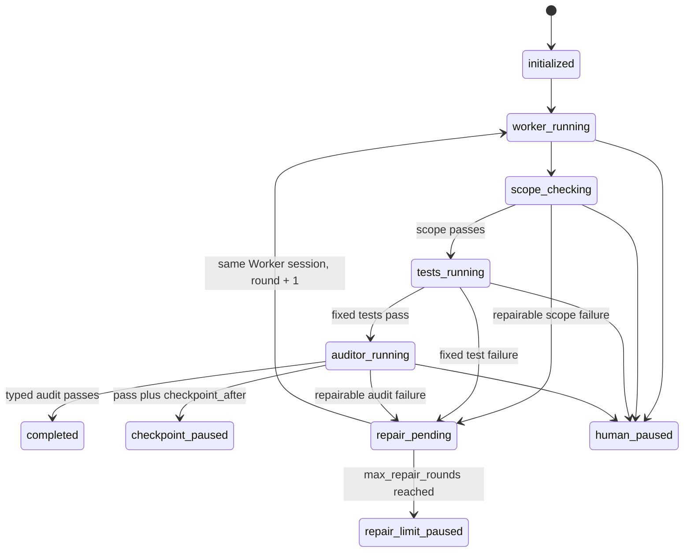
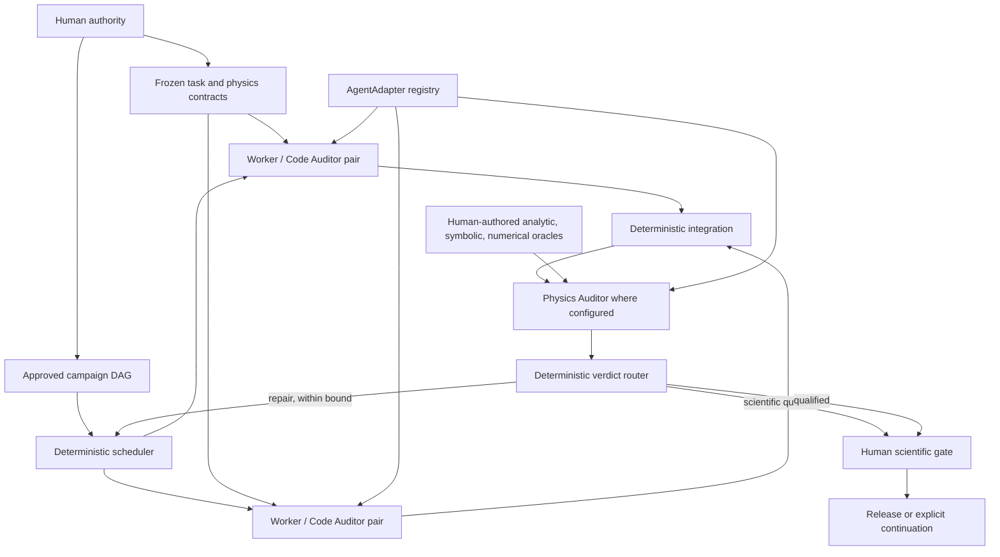
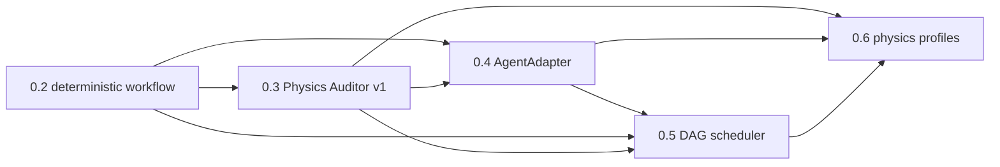

# Upgrade program: 0.3 through 0.6

Status: implementation roadmap, not current product behavior. Proposed component and
field names are marked **Proposed**. This program starts from package version `0.2.0`
at commit `189ea53f9b948b64ff2b3564a326e21b37021d81`.

## Current 0.2.0 baseline

Version 0.2.0 is sequential and Codex-backed. It does not support arbitrary model
providers, heterogeneous role backends, task DAGs, parallel scheduling, or a distinct
Physics Auditor.

The current supported single-substage path is implemented by
`workflow_engine.run_substage` and driven synchronously by `_drive_unchecked`:

The exact current boundaries that upgrades must preserve are:

- `SubstageSpecification` schema version 1 freezes one workspace, human contract and
  prompts, role models and timeouts, shell-free `WorkflowTest` commands,
  `allowed_paths`, `protected_paths`, `max_repair_rounds`, and `checkpoint_after`.
- `WorkerModelResult`, `AuditFinding`, and `AuditorModelResult` are strict immutable
  Pydantic models. Model JSON is untrusted until strict validation succeeds.
- `WorkflowState`, `PendingAction`, `JournalEntry`, and action records drive recovery.
  A hash-chained `journal.jsonl` records intent before external work and completion
  afterward. Uncertain completion pauses instead of relaunching.
- `ROLE_POLICIES` fixes a persistent `workspace-write` Worker and fresh ephemeral
  `read-only` Auditor, approval `never`, with network/web disabled by the adapter.
- `run_prepared_codex` and `workflow_integrity.verify_codex_artifacts` are coupled to
  Codex command, event, metadata, completion-manifest, and thread-ID semantics.
- `ReplayCampaignSpecification.tasks` is an ordered tuple. `replay_campaign_engine`
  advances one `current_task_index` at a time and publishes `final-candidate/` only
  after all tasks are terminal in manifest order.
- `run-visible-campaign`, `resume-visible-campaign`, and
  `visible-campaign-status` are synchronous visible-only campaign commands.
- Direct original historical replay is authoritative: 5/5 functional, hidden,
  visible, and changed-path acceptance, and 0/5 exact historical identity. The
  packaged Bubblewrap evaluation path is experimental and is not an upgrade target.

Protected prepared campaigns, hidden tests, historical golds, final candidate payloads,
and private run evidence remain outside model-readable authority and outside all
qualification fixtures proposed here.

## Target architecture

The target separates deterministic control from replaceable model transports and from
scientific judgment:

The model never becomes the scientific oracle. It produces bounded typed observations;
deterministic code validates identifiers, evidence references, oracle outcomes, state
invariants, and repair bounds. A human owns conventions, gauge and constraint
resolution, new physical interpretations, dependency approval, and scientific release.

## Release sequence

| Release | First-class milestone | Required outcome | Explicitly deferred |
|---|---|---|---|
| 0.3.0 | Physics Auditor v1 | Structured physics contract, typed report, fixed profiles, deterministic routing, seeded-defect suite, mandatory scientific gate | Arbitrary providers, parallel DAGs, broad research profiles |
| 0.4.0 | Agent backend abstraction | `AgentAdapter` boundary, normalized evidence, Codex compatibility adapter, generic exec adapter, conformance suite, per-role backend/model selection | Concurrent task execution |
| 0.5.0 | Parallel campaign scheduler | Human-approved explicit DAG, isolated task worktrees, resource leases, crash recovery, deterministic integration and integration audits | Broad scientific-claim automation |
| 0.6.0 | Expanded physics research profiles | Derivation, implementation, numerical evidence, and scientific-claim profiles with claim ledgers and required human gates | Autonomous scientific interpretation or protected-evaluation access |

Physics Auditor v1 is the first implementation priority. It uses the current Codex
backend in 0.3.0 but stores its role configuration in a shape that 0.4.0 can translate
to an adapter/model selection without changing physics-report semantics.

## Track dependencies

- Physics contracts and typed reports do not depend on provider abstraction; keep them
  provider-neutral from the start.
- The 0.3 engine integration may call Codex through the current `CodexInvoker`, but a
  physics report must contain no Codex event or session fields.
- Parallel Worker–Auditor pairs depend on a provider-neutral action identity and
  capability record; therefore scheduler implementation follows 0.4.0.
- Expanded profiles depend on the v1 evidence/reference vocabulary and claim-ledger
  design, not on new evaluator namespaces.

## Module-level implementation map

Proposed modules are new; all other names exist in 0.2.0.

| Proposed component | Likely existing modules to modify or wrap | Purpose |
|---|---|---|
| **Proposed** `physics_models.py` | `workflow_models.py`, `structured_outputs.py` | Strict physics-contract, oracle-result, report, and decision models |
| **Proposed** `physics_prompts.py` | `workflow_prompts.py` | Deterministic physics evidence assembly and engine-owned JSON schema |
| **Proposed** `physics_oracles.py` | `test_runner.py`, `git_evidence.py`, `durable_state.py` | Fixed offline oracle commands, bounded typed results, no-workspace-change check |
| **Proposed** `physics_auditor.py` | `workflow_engine.py`, `workflow_integrity.py` | Physics-audit action intent/proof, report validation, deterministic routing |
| Versioned substage/state dispatch | `workflow_models.py`, `workflow_engine.py`, `workflow_integrity.py`, `cli.py` | Keep schema/state version 1 behavior exact while adding physics version 2 |
| **Proposed** `agent_models.py` | `codex_models.py`, `workflow_models.py` | Normalized provider-neutral request/result/capability types |
| **Proposed** `agent_adapter.py` | `codex_adapter.py`, `workflow_engine.CodexInvoker`, `WorkflowServices` | Protocol, registry, negotiation, and launch boundary |
| **Proposed** `codex_agent_adapter.py` | `codex_adapter.py`, `workflow_integrity.py` | Compatibility wrapper preserving current command and proof semantics |
| **Proposed** `generic_exec_adapter.py` | `codex_adapter.py`, `redaction.py`, `auth_confidentiality.py` | Shell-free provider executable contract and secret-safe launch |
| **Proposed** `campaign_dag_models.py` | `replay_campaign_models.py`, `replay_campaign_sources.py` | Strict DAG, dependency approval, path claims, resource requests |
| **Proposed** `campaign_scheduler.py` | `replay_campaign_engine.py`, `durable_state.py` | Ready-set scheduling, leases, failure propagation, recovery |
| **Proposed** `task_worktrees.py` | `git_evidence.py`, `candidate_export.py` | Per-task branch/worktree lifecycle and sealed change capture |
| **Proposed** `campaign_integration.py` | `candidate_export.py`, `workflow_engine.py` | Canonical patch application order, integration tests and audits |
| CLI additions | `cli.py`, `doctor.py` | Versioned validation/run/status commands and backend diagnostics |
| Qualification suites | `tests/test_workflow_*.py`, `tests/test_codex_*.py`, `tests/test_replay_campaign.py` | Synthetic physics defects, adapter conformance, and DAG recovery cases |
| Roadmap/user docs | `README.md`, `docs/architecture.md`, `docs/workflow_engine.md`, `docs/campaigns.md`, `docs/security.md` | Promote features only after their release gates pass |

## Migration and compatibility policy

1. Keep `SubstageSpecification`, `WorkflowState`, `PendingAction`,
   `AuditorModelResult`, Codex artifacts, and campaign schema version 1 readable and
   resumable. Never reinterpret or rewrite an existing journal.
2. Add physics as a discriminated substage schema/state version 2. Version 1 ordinary
   non-physics substages keep their current prompt bytes, action IDs, transitions,
   repair semantics, CLI output, and Codex policies.
3. Do not silently insert a Physics Auditor into existing substages. Physics behavior
   requires an explicit frozen `physics_contract_path` and profile.
4. In 0.4.0, map omitted backend fields in existing version-1 configuration to the
   compatibility Codex adapter. Existing model and reasoning-effort values retain their
   exact meaning for that adapter.
5. Adapter capabilities are checked before intent is journaled. No fallback provider,
   model substitution, session substitution, or capability downgrade is automatic.
6. Introduce campaign DAGs as a new manifest version and new run-state version. Ordered
   campaign version 1 remains sequential and supported.
7. Candidate and direct-replay schemas are unchanged unless a future separately
   approved migration requires them. The roadmap does not change historical evidence.
8. Pre-1.0 schema changes are still explicit and versioned. Unknown fields remain
   rejected (`extra="forbid"`); no `extensions`, arbitrary metadata, or open evaluator
   namespace is introduced.

## Qualification strategy

Qualification is layered and synthetic:

- Model-free unit tests validate strict YAML/JSON, duplicate rejection, normalized
  paths, fixed enums, evidence-reference closure, derived verdicts, graph ordering,
  resource accounting, and migration dispatch.
- Synthetic adapter doubles exercise success and every transport failure without live
  providers. Codex compatibility tests compare normalized request, shell-free command,
  artifact hashes, status, session resume, and auditor ephemerality with 0.2.0.
- Seeded physics defects use small public/synthetic equations and implementations with
  human-authored oracle outputs. They contain no historical or protected data.
- Crash-injection tests stop at every action intent/completion, journal append,
  scientific-gate record, lease, worktree seal, and integration boundary.
- Synthetic DAG tests cover chains, diamonds, disjoint parallel tasks, declared path
  conflicts, cycles, resource starvation, process loss, failed ancestors, deterministic
  integration order, and audit failure.
- Documentation tests check relative links and current-versus-planned language.
- Release candidates run the existing ordinary-substage synthetic suite unchanged and
  build both wheel and sdist. Full historical replay is not part of routine roadmap
  qualification and protected inputs are never exposed to a model.

Each release-specific document defines exact gates:

- [Physics Auditor v1](physics_auditor_v1.md) for 0.3.0;
- [agent backend abstraction](agent_backend_abstraction.md) for 0.4.0;
- [parallel campaign scheduler](parallel_campaign_scheduler.md) for 0.5.0; and
- [physics research profiles](physics_research_profiles.md) for 0.6.0.

## Risk register

| Risk | Consequence | Mitigation | Release stop trigger |
|---|---|---|---|
| Model report treated as truth | False scientific pass | Strict typed input, evidence-reference closure, deterministic derivation, human gate | Any terminal route can be controlled by unchecked prose/model verdict |
| Convention or gauge ambiguity hidden in repair | Scientifically invalid patch | Fixed convention registry; mandatory human gate on change/unresolved status | Engine permits automatic completion with such a condition |
| Physics schema leaks into ordinary substages | Backward incompatibility | Versioned dispatch and byte-for-byte v1 regression fixtures | Any v1 prompt/action/state drift without explicit migration |
| Codex-specific proof leaks into normalized API | Other adapters cannot conform honestly | Separate normalized proof from adapter evidence; capability negotiation | Provider requires fabricated Codex thread/event fields |
| Capability overclaim by generic adapter | Sandbox/session guarantee is false | Conformance record and fail-closed negotiation | Required capability cannot be independently qualified |
| Stateless repair loses Worker context | Inconsistent bounded repair | Explicit session mode; deterministic reconstruction or reject backend | Backend cannot preserve/reconstruct required context |
| Parallel write/read conflict | Lost work or stale audit | Exact path claims, reachability rules, isolated worktrees, sealed deltas | Conflict cannot be decided deterministically before launch |
| Lease split-brain | Duplicate model action | Journaled lease/action intent, exclusive locks, uncertain-action pause | Two owners can hold one task generation |
| Integration order changes output | Non-reproducible candidate | Canonical topological/task-ID order and hash-pinned deltas | Same inputs yield different integration bytes |
| Oracle is model-generated or mutable | Circular validation | Human-authored frozen oracle specs; deterministic runner; hash binding | A model can add/change an oracle in its writable authority |
| Oracle runner mutates workspace | Audit contaminates evidence | Scratch-only outputs plus before/after Git proof; hard fail on drift | Drift cannot be detected or isolated |
| Protected evaluation enters prompts | Data leakage and invalid evaluation | Authority-root checks and synthetic-only qualification | Any protected locator/content becomes model-readable |
| Scope expands into evaluator hardening | Delays core milestones | Keep direct replay authoritative; packaged evaluator remains experimental | Milestone requires namespace/compiler closure work |

## Hard-stop conditions

Stop implementation or release qualification if any of the following occurs:

- Accurate behavior would require reading protected historical fixtures, golds, final
  candidate contents, hidden tests, or private run evidence.
- A migration requires modifying historical campaign/candidate evidence or replaying a
  live campaign.
- A model must be granted protected evaluation access, permission/acceptance authority,
  or the ability to change its own physics oracles.
- A scientific terminal decision depends only on model prose or an unvalidated
  provider-specific field.
- Convention changes, unresolved gauge/constraint questions, or new physical
  interpretations can bypass a recorded human decision.
- Existing version-1 runs cannot be resumed without rewriting their journal or
  weakening integrity checks.
- A provider cannot meet declared read-only, no-network, structured-output, secret, or
  session requirements and the engine would need to pretend that it can.
- Parallel execution cannot prove path independence and dependency approval before
  launch.
- Crash recovery would repeat an action whose external completion is uncertain.
- The work expands into a new open-ended extension namespace or packaged-evaluator
  hardening effort.

## Recommended implementation order

1. Freeze 0.2.0 compatibility fixtures for version-1 substage loading, prompt hashes,
   transition sequences, Codex action proof, bounded repairs, and ordered campaigns.
2. Implement strict provider-neutral physics contract/report models and model-free
   deterministic verdict derivation.
3. Add frozen oracle execution/evidence and the Physics Auditor prompt/report path,
   initially through current Codex, with mandatory human scientific release.
4. Qualify 0.3.0 against seeded defects and unchanged ordinary substages.
5. Extract normalized agent request/result/capability models, then wrap current Codex
   behavior without changing it.
6. Add the generic exec adapter and provider conformance harness; qualify 0.4.0.
7. Add strict DAG and approval models, then task worktrees, resource leases, ready-set
   scheduling, recovery, and deterministic integration in that order.
8. Qualify 0.5.0 entirely on synthetic DAGs before any real campaign pilot.
9. Extend the proven physics vocabulary into derivation, numerical-evidence, and
   scientific-claim profiles with claim ledgers and human gates for 0.6.0.

## Out of scope

- Production code implementation in this roadmap change.
- Live campaigns, historical replay, candidate mutation, or protected-data inspection.
- Autonomous scientific truth, automatic convention selection, gauge fixing, or new
  physical interpretation.
- Unbounded repair, dynamic model-written tests/oracles, or model-chosen permissions.
- Arbitrary provider support in 0.3.0 or parallel scheduling before 0.5.0.
- Distributed scheduling, multi-host consensus, Kubernetes, remote worktree storage,
  or a general-purpose build farm.
- A plugin/extension namespace, user-supplied Python callbacks, shell command strings,
  or evaluator hardening.
